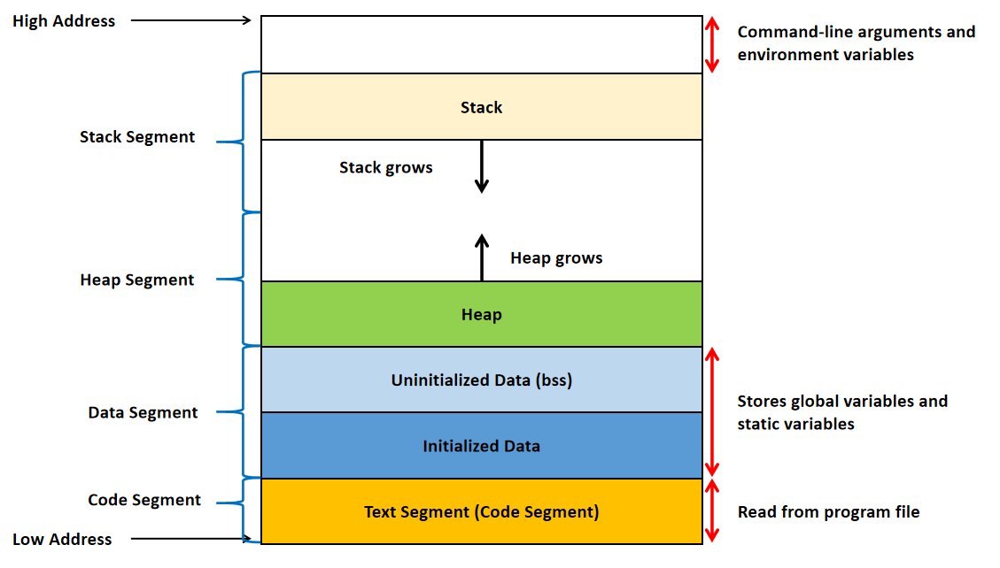

# Pointers

**NOTE:**

Pointers for C and C++ are having the same core concepts.

## Introduction

`Pointer` is a special `variable that holds the memory address of another variable`, rather than strong a direct value itself.

Pointers allows programs to access and manipulate data in memeory efficiently, making them a key feature for system-level programming and dynamic memory management.

When we access a pointer directly, we get the address it holds, not the actual data stored at that location.

## Declare Pointer

```c
int* ptr;
```

From the example above, pointer `ptr` is declared.

**NOTE:**

Syntax to declare a new pointer:

```
<data_type>* <ptr_variable_name>;
```

## Assign Address to Pointer

```c
int val = 22;
int* ptr = &val; // '&' indicates get memory address of val
```

From the example above, pointer `ptr` stores the address of variable `val` using **address of operator(`&`)**

**IMPORTANT NOTE:**

- `Both pointer and variable should be of the same type`. Else, type mismatch error occurs.

## Dereferencing

**Pseudocode samples in C:**

```c
int va1 = 22;
int* ptr = &val; // Declare a pointer and then assign address to the pointer in 1 line

printf("%d\n", *ptr); // Get value of val using * operator --> Deferencing

printf("%d\n", ptr); // Get the memory address value of val
```

or

```c
int* ptr; // Declare pointer first
int va1 = 22;
ptr = &val; // Then, assign address to pointer

printf("%d\n", *ptr); // Get value of val using * operator --> Deferencing

printf("%d\n", ptr); // Get the memory address value of val
```

From the examples, you can see **`*`** operator is used to dereference to **get the value present at the memory address pointed by pointer**.

## Void Pointer

`Void pointer` (**void***) is a special type of pointer that has **no associated data type**.

It can hold the address of any data type, making it useful for generic programming.

However, since the type is unknown, the compiler doesn't know how many bytes to read or how to interpret the data.

Therefore, **a void pointer cannot be directly dereferenced**. It must first be explicilty typecast to the appropriate pointer type.

**Sample Codes:**

- C

```c
#include <stdio.h>

int main()
{
    int x = 42;

    void* ptr = &x; // Declare void pointer

    printf("%d\n", ptr); // Get void pointer holding address value

    // To derefence, you need to typecast accordingly as example below
    printf("%d\n", *(int*)ptr); // Get dereferenced value

    return 0;
}
```

- C++

```c++
#include <iostream>

int main()
{
    int x = 42;

    void* ptr = &x; // Declare void pointer

    std::cout << ptr << std::endl; // Get void pointer holding address value

    // To derefence, you need to typecast accordingly as example below
    std::cout << *(static_cast<int*>(ptr)) << std::endl; // Get dereferenced value

    return 0;
}
```

## Null Pointer

Null pointer is not pointing to any valid memory location.

To initialize a null pointer:

```c++
int* ptr = nullptr; // For C++11 and above

int* ptr = NULL; // For C and C++11 & below

int* ptr = 0; // This also can, but not preferred 
```

## Changing Pointer Type

You can change the pointer type as the sample pseudocode below. However, if data type of pointer changed has different number of bytes, you will see the dereference value differ as sample below.

**Pseudocode sample in C:**

```c
int a = 1025;
int* ptr;
ptr = &a;

printf("%d\n", ptr) // Here, you get address of a

printf("%d\n", *ptr) // Here, you get 1025

// Changing pointer type
char* p0;
p0 = (char*)ptr; // Typecasting

printf("%d\n", p0) // Here, still print address of a, because still pointing at the same starting address

printf("%d\n", *p0) // Here, you only get 1
/*
Because... 
1025 => 00000000 00000000 00000100 00000001 (in binary)
Since char only holds 1 byte (8 bits), therefore, *p0 = 1 [00000001, 1 byte starting from LSB]
*/
```

## Pointer Arithmetic

### Incrementing a Pointer

**Pseudocode sample in C:**

```c
int a = 22;
int* ptr = &a; // Let's say address of a is 1000

printf("%d\n", ptr); // Here, print 1000

ptr++; // Pointer increment

printf("%d\n", ptr); // Here, print 1004
// Because int has 4 bytes
// Therefore, 1000 + 4 = 1004
```

### Decrementing a Pointer

**Pseudocode sample in C:**

```c
int a = 22;
int* ptr = &a; // Let's say address of a is 1000

printf("%d\n", ptr); // Here, print 1000

ptr--; // Pointer decrement

printf("%d\n", ptr); // Here, print 996
// Because int has 4 bytes
// Therefore, 1000 - 4 = 996
```

### Addition of Constant from Pointer

**Pseudocode sample in C:**

```c
int a = 22;
int* ptr = &a; // Let's say address of a is 1000

printf("%d\n", ptr); // Here, print 1000

ptr = ptr + 5; // Addition by 5

printf("%d\n", ptr); // Here, print 1020
// Because int has 4 bytes
// Therefore, 1000 + 5(4) = 1020
```

### Subtraction of Constant from Pointer

**Pseudocode sample in C:**

```c
int a = 22;
int* ptr = &a; // Let's say address of a is 1000

printf("%d\n", ptr); // Here, print 1000

ptr = ptr - 5; // Subtract by 5

printf("%d\n", ptr); // Here, print 980
// Because int has 4 bytes
// Therefore, 1000 - 5(4) = 980
```

## Pointer to Pointer

We can have **multi-level pointers**, such as \*\*\*ptr3, \*\*\*\*ptr4 and so on.

The most popular of them is **double pointer** (`pointer to pointer`). 

It stores the memory address of another pointer. Instead of pointing to a data value, they point to another pointer.

Pseucode below shows implementation of pointer to pointer.

**Pseudocode sample in C:**

```c
int val = 22;
int* ptr = &val;
int** ptr2 = &ptr; // pointer to pointer

printf("%d\n", ptr2); // Get address of ptr
printf("%d\n", *ptr2); // Get address of val
printf("%d\n", **ptr2); // Get value of val
```

## Pointers as Function Arguments &mdash; Call by Reference

**Sample code in C:**

```c
#include <stdio.h>

void increment(int* x) // Call by reference
{
    *x += 1; // *x = *x + 1 (Dereference then increment by 1)
    printf("Address in the increment function = %d\n", x); // Address value = 1234
}

int main()
{
    int a = 3;
    // Let's say address of a is 1234

    printf("Value of a before increment = %d\n", a); // a = 3

    increment(&a); 

    printf("Value of a after increment = %d\n", a); // a = 3 + 1 = 4
    printf("Address after increment function = %d\n", x); // Address value = 1234

    return 0;

}
```

## Pointers and Arrays

### Quick Recap on Arrays

- Declare an array

```c
int arr[5]; // Declare an array to store 5 integer values
```

- Initialize an array
```c
// Initialize all values in the array
int arr1[5] = {2, 4, 6, 8, 10};

// Partially initialization
int arr2[5] = {2, 4, 6} // The remaining will be with value 0

// Skipping the size of array
int arr[] = {2, 4, 6}

//Initialize all elements in array to 0
int array[5] = {0}
```

- Accessing array index

**Pseudocode sample in C:**

```c
int arr[5] = {2, 4, 6, 8, 10};
// From the array above, there are 5 elements into it, and the index value will be from 0 to 4
// In short, 0 < index < size-1

printf("%d\n", arr[2]); // Here, prints 6 [3rd element ; at index position 2]
```

- Array also can be multidimensional.

```
<data_type> <array_name>[<size1>][<size2>]...[<sizeN>];
```

### Simple Implementation with Arrays and Pointers

**Pseudocode sample in C:**

```c
int arr[4] = {1, 2, 3, 4}; // Declare array
int* ptr = arr; // Declare pointer

printf("%d\n", arr); // Print address of 1st element of array, eqivalent to &arr[0]

printf("%d\n", *(arr)); // Print value of 1st element of array, eqivalent to arr[0], which is 1

printf("%d\n", arr + 2); // Print address of 3rd element of array, eqivalent to &arr[2]

printf("%d\n", *(arr + 2)); // Print value of 3rd element of array , eqivalent to arr[2], which is 3
```

### Arrays as Function Arguments

**Sample code in C:**

```c
#include <stdio.h>

void sorting(int* ptr, int size) // int* ptr == int ptr[]
{
    for (int i = 0; i < size; i++){
        printf("%d ", *(ptr + i));
    }
}

int main()
{
    int arr[] = {1, 2, 3, 4, 5};
    int* ptr = arr;
    int size = sizeof(arr) / sizeof(arr[0]); // Get the size of array
    sorting(ptr, size);
    // Output message: 1 2 3 4 5
}
```

## Character Arrays and Pointers

### Character Arrays

String is a group of characters.

Character array is a way to store string.

**NOTE:** 

- Size of character array must be **greater or equal to** number of characters in string + 1

```c
// This will not work, because...
// size of char array must >= num. of char in string + 1
char A[4];
A[0] = "J";
A[1] = "O";
A[2] = "H";
A[3] = "N";

// To make it work, below is example
char B[8];
B[0] = "J";
B[1] = "O";
B[2] = "H";
B[3] = "N";
B[4] = "\0"; // NULL character, to tell that the last character of the string is at B[3], and the rest after B[3] are NULL terminated

char B[8] = {"J", "O", "H", "N", "\0"}

// Another way, you can use string literal as below
char C[8] = "JOHN";
char D[] = "JOHN";
```

### Simple Example of Implementation of Character Array and Pointer

**Pseudocode sample in C:**

```c
char C[8] = "JOHN";
char* ptr;

ptr = C; // NOTE: "C = ptr;" is invalid

printf("%d\n", *ptr); // Here, prints "J"
printf("%d\n", C[0]) // Prints "J" as well
printf("%d\n", ptr); // Here, print the address of "J" in array C[8]

printf("%d\n", *(ptr + 2)); // Here, prints "H"
printf("%d\n", C[2]) // Prints "H" as well
printf("%d\n", (ptr + 2)); // Here, print the address of "H" in array C[8]
```

### Character Arrays as Function Arguments

**Sample code in C:**

```c
#include <stdio.h>
#include <string.h>

void printString(char* C) // If you disable element value to be changed in this function only, you can update to (const char* C)
{
    while(*C != "\0"){
        printf("%c", *C);
        C++;
    }
    printf("\n");
}

int main()
{
    char D[8] = "JOHN";
    // You can do as below which is similar:
    // char* D = "JOHN"; --> equivalent to const char D[8] = "JOHN";
    // However, the sample line above, you cannot alter the element in the array. [e.g. set D[0] = "A" is invalid]

    printString(D); // Here, prints "JOHN"

    return 0;
}
```

## Pointers and Multi-dimensional Arrays

### Working with 2D Arrays

**Pseudocode sample in C:**

```c
// Example of 2D array
//int A[2][3]; --> it has 2 rows & 3 columns

// Initialize 2D array
int A[2][3] = {{1,2,3}, {4,5,6}};
int A[2][3] = {1,2,3,4,5,6}; //Traverse

//int* ptr = A;
// Above commented code is invalid
// Because A is not normal 1D array

// Usage of pointer for 2D array
int (*ptr)[3] = A; // equivalent to ptr[][3] = A[2][3]
// Pointer initialization syntax for 2D array: 
// <data_type> (*<ptr_name>)[<max_column>]

printf("%d\n", ptr); // Print address of A[0]
printf("%d\n", *ptr); // Print address of A[0][0]
printf("%d\n", **ptr); // Print 1, which is the value of A[0][0]

printf("%d\n", (ptr + 1)); // Print address of A[1]
printf("%d\n", *(ptr + 1)); // Print address of A[1][0]
printf("%d\n", (*(ptr + 1) + 1)); // Print address of A[1][1]
printf("%d\n", **(ptr + 1)); // Print 4, which is the value of A[1][0]
printf("%d\n", *(*(ptr + 1) + 1)); // Print 5, which is the value of A[1][1]

printf("%d\n", *(*ptr + 1)); // Print 2, which is the value of A[0][1]
printf("%d\n", (*ptr + 1)); // Print address of A[0][1]

// NOTE:
// B[i][j] = *(B[i] + j) = *(*(B + i) + j)
// &B[i][j] = *(B + i) + j
```

### Working with Multi-dimension Arrays

Implementation is very similar as in the [sub-chapter above](#working-with-2d-arrays)

Some extra stuff to take note will be explained in sample pseudocode below.

**Pseudocode sample in C:**

```c
// Example of 3D array
// int A[3][2][2]; --> it has depth size of 3, 2 row and 2 columns

// Initialize 3D array
int A[3][2][2] = {{{1,2}, {3,4}},{{5,6}, {7,8}},{{9,10}, {11,12}}};
int A[3][2][2] = {1,2,3,4,5,6,7,8,9,10,11,12}; // Traverse

// Usage of pointer for 2D array
int (*ptr)[2][2] = A;
// Pointer initialization syntax for 3D array: 
// <data_type> (*<ptr_name>)[<max_row>][<max_column>]

printf("%d\n", ptr); // Print address of A[0]
printf("%d\n", *ptr); // Print address of A[0][0], same as address of A[0]
printf("%d\n", **ptr); // Print address of A[0][0][0]
printf("%d\n", ***ptr); // Print 1, which is the value of A[0][0][0]

// NOTE [with 3D array examples]:
// A[i][j][k] = *(A[i][j] + k) = *(*(A[i] + j) + k) = *(*(*(A + i) + j) + k)
// &A[i][j][k] = *(*(A + i) + j) + k
```

### Multi-dimension Arrays as Function Arguments

**Sample code in C:**

```c
#include <stdio.h>

// Function for 2D array
void array2D(int (*ptr)[3]) // int ptr[][3] is fine as well
{
    // Write code for function array2D
}

// Function for 3D array
void array3D(int (*ptr)[2][3]) // int ptr[][2][3] is fine as well
{
    // Write code for function array3D
}

int main()
{
    int A[2][3] = {{1,2,3},{4,5,6}}; //2D array

    int B[2][2][3] = {{{1,2,3},{4,5,6}},{{7,8,9},{10,11,12}}}; //3D array

    array2D(A); // won't work if y is not equal to 3 in A[x][y], as per reference function mentioned

    array3D(B); // won't work if y is not equal to 2 and z is not equal to 3 in B[x][y][z], as per reference function mentioned

    return 0;
}
```

## Dynamic Memory Allocation in C/C++

### Memory Management in Programming

A generic programming memory is organized into speciic regions (segments) as shown in the image below, where each serving distinct purposes for program execution.

<br>

</img>

#### 1) `Text Segment`

- Also known as `code segment`, where the **executable code of the program is stored**
- Contains **compiled machine code of the program's functions and instructions**
- Usually **read-only** and stored in the **lower parts of the memory** to **prevent accidental modification of the code** while the program is running
- Size of the text segment is determined by the number of instructions and the complexity of the program 

#### 2) `Data Segment`

- **Stores global and static variables** created by programmer
- Present just above the code segment of the program
- Divided into 2 parts, which are `initialized data segment` and `uninitialized data segment(BSS)`
- Initialized data segment, as the name suggests, is the part of data segment contains global and static variables which have been initialized
- Uninitialized data segment often called the "**bss**" segement, named after an ancient assembler operator, that stood for "Block Started by Symbol" contains global and static variables that are not initialized

#### 3) `Heap Segment`

- Heap segment is where **dynamic memory allocation** usually takes place
- The heap area **begins at the end of the BSS segment and grows towards the larger addresses from there**
- Heap segment is shared by all shared libraries and dynamically loaded modules in a process

<br>

**EXTRAS:**

- In C and C++, we can perform dynamic memory allocation with our control and need to be responsible ourselves, which will be discussed in next sub-chapters
- In Python, Java, or high-level programming language, there's Garbage Collector (GC) to automatically handle memory management, using algorithms like Mark-and-Sweep, Reference Counting, etc
- Reference link for statements under **EXTRAS** section: <a href="https://www.tutorialspoint.com/computer_programming/computer_programming_dynamic_memory_management.htm">Computer Programming - Dynamic Memory Management</a>

#### 4) `Stack Segment`

- The stack is a region of memory used for **local variables and function call management**
- Each time a function is called, a `stack frame` is created to store local variables, function parameters, and return addresses
- This stack frame is stored in this segment
- The stack segement is generally **located in the higher addresses of the memory and grows opposite to heap**
- They adjoin each other so when stack and heap meet, free memory of the program is said to be exhausted (or known as stack overflow)

### Dynamic Memory Allocation in C with Pointers (`malloc`, `calloc`, `realloc`, `free`)

Dynamic memory allocation is possible to be done in C by using the following 4 library functions provided by `<stdlib.h>` library:

- `malloc()`
- `calloc()`
- `realloc()`
- `free()`

<br>

#### `malloc`

`malloc()` function, stands for **memory allocation**, is used to **allocate a single block of contiguous memory** on the heap at runtime.

The memory allocated by `malloc()` is **uninitialized**, meaning it **contains garbage values**.

**Generic syntax for `malloc()`**:

```c
void* ptr = malloc(<size>);

// <size> = number of bytes to allocate
```

**Preferred syntax for `malloc()`**:

```c
<data_type>* ptr = (<data_type>*)malloc(<number_of_elements>*sizeof(<data_type>));

// Typecasting method is much preferred
// So that, you can dereference easily

// With sample syntax above, you can do as below sample line
int* ptr = (int*)malloc(3*sizeof(int));

// From the line above, you are allocating a block of memory where storing 3 integers 
// [Total: 3*4 = 12 bytes of memory, where int has 4 bytes]
// But all these 3 integers in the block are garbage values
```

This function returns a void pointer to the allocated memory that needs to be converted to the pointer of required type to be usable.

**If allocation fails, it returns NULL pointer**.

<br>

#### `calloc`

`calloc()` function, stands for **contiguous allocation**, is **similar to malloc()**, but it **initializes the allocated memory to zero**.

It is **used when you need memory with default zero values**.

**Generic syntax for `calloc()`**:

```c
void* ptr = calloc(<number_of_elements>, <size>);

// <size> = number of bytes to allocate
```

**Preferred syntax for `calloc()`**:

```c
<data_type>* ptr = (<data_type>*)calloc(<number_of_element>, sizeof(<data_type>));

// Typecasting method is much preferred
// So that, you can dereference easily

// With sample syntax above, you can do as below sample line
int* ptr = (int*)calloc(3, sizeof(int));

// From the line above, you are allocating a block of memory where storing 3 integers 
// [Total: 3*4 = 12 bytes of memory, where int has 4 bytes]
// All these 3 integers in the block are having value of zero by default
```

This function returns a void pointer to the allocated memory that needs to be converted to the pointer of required type to be usable.

**If allocation fails, it returns NULL pointer**.

<br>

#### `realloc`

`realloc()` function is used to **resize a previously allocated memory block**.

It allows you to change the size of an existing memory allocation without needing to free the old memory and allocate a new block.

**Generic syntax for `realloc()`**:

```c
ptr = realloc(ptr, <new_size>);

// Here, assume ptr has done allocated before either via malloc() or calloc()
// <new_size> = new number of bytes to allocate
```

**Preferred syntax for `realloc()`**:

```c
ptr = (<data_type>*)realloc(ptr, <new_number_of_element>*sizeof(<data_type>));

// Here, assume ptr has done allocated before either via malloc() or calloc()

// Typecasting method is much preferred

// With sample syntax above, you can do as below sample line
ptr = (int*)realloc(3, sizeof(int));

// From the line above, you are reallocating a block of memory to store 3 integers 
// The reallocated memory block will have:
// 3*4 = 12 bytes of memory, where int has 4 bytes
```

This function **returns a pointer to the newly allocated memory**, or **NULL if the reallocation fails**. 

**If it fails, the original memory block remains unchanged**. Also, it is important to note that if `realloc()` fails and returns NULL, the **original memory block is not freed**, so you should not overwrite the original pointer until you've successfully allocated a new block.

To prevent memory leaks, it's a good practice to handle the NULL return value carefully as sample pseudocode below:

```c
int* ptr = (int*)malloc(5*sizeof(int)); // Allocation

int* temp = (int*)realloc(ptr, 10*sizeof(int)); // Reallocation, but with good practice where new or temp pointer is created first
// To prevent original block memory allocated to be overwritten in case fail to reallocate

//Only update the pointer if reallocation is successful
if (temp == NULL){
    printf("Memory Reallocation Failed\n");
} else {
    ptr = temp;
}

// Remember to free memory block after done using as below
free(ptr);
ptr = NULL;

return 0; // End main function block
```

**EXTRAS:**

- Syntax equivalent to `free()`:

```c
int* ptr = (int*)realloc(ptr, 0); // free(ptr);
```

- Syntax equivalent to `malloc()`:

```c
int* ptr = (int*)realloc(NULL, 4*sizeof(int)); //int* ptr = malloc(4*sizeof(int));
```

<br>

#### `free`

The memory allocated using functions `malloc()` and `calloc()` will not be de-allocated on their own.

Therefore, `free()` function is **used to release dynamically allocated memory** back to operating system.

It is **essential to free memory** that is no longer needed to **avoid memory leaks**.

**Syntax for `free()`**:

```c
free(ptr);
```

**After freeing the memory block**, the **pointer becomes invalid**, and it is **no longer pointing to a valid memory location**.

**After calling `free()`**, it is a **good practice to set the pointer to NULL** to avoid using a "`dangling pointer`", which points to a memory location that has been deallocated.

```c
ptr = NULL; // Set pointer to NULL after free() is being used to avoid "dangling pointer"
```

**Pseudocode on good practice to free memory dynamically**:

```c
// Now new memory block is allocated
int* ptr = (int*)malloc(3*sizeof(ptr));

// Let's assume here the allocated memory block is done using...

free(ptr); // Free immediately to avoid memory leak

ptr = NULL; // Then, set pointer to NULL to avoid "dangling pointer"
```

<br>

#### Issues Associated with Dynamic Memory Allocation in C

As useful as dynamic memory allocation is, it is also prone to errors that requires careful handling to avoid the high memory usage or even system crashes.

Few of the common errors are as below:

- `Memory Leaks`: Failing to free dynamically allocated memory can cause undefined behaviour or crashes
- `Dangling Pointers`: Using a pointer after freeing its memory can cause undefined behaviour or crashes
- <a href="https://www.geeksforgeeks.org/operating-systems/what-is-fragmentation-in-operating-system/">`Fragmentation`</a>: Repeated allocations and deallocations can fragment memory, causing inefficient use of heap space 

<br>

### Dynamic Memory Allocation in C++ with Pointers (`delete`, `new`)

In C++, for greater control and flexibility, dynamic memory allocation on the `heap` is used, allowing **manual allocation with `new`** and **manual deallocation with `delete`**.

<br>

#### `new`

```c++
// To allocate memory block with 1 element only...
int* ptr = new int; //equivalent to int* ptr = (int*)malloc(sizeof(int)); in C 
ptr = 6;

// The 2 code lines above can be written into this 1 single line below
int* ptr = new int(6);
```

```c++
// To allocate memory block with more than 1 element or an array of elements
int* ptr = new int[3]; // equivalent to int* ptr = (int*)malloc(3*sizeof(int)); in C
// To allocate memory block with 3 integers
ptr[0] = 1;
ptr[1] = 2;
ptr[2] = 3;

// A more preferrable method if to allocate memory block with more than 1 elements and initialize each of them in single line
int* ptr = new int[3]{1, 2, 3};
```

**What if enough memory is not available during runtime?**

If enough memory is not available in the heap to allocate, the `new` request indicates failure by throwing an exception of type `std::bad_alloc`, unless "`std::nothrow`" is used with the `new` operator, in which case it returns a `nullptr` pointer.

Therefore, it is a good idea to check for the pointer variable produced by `new` before using its program as sample pseudocode below.

```c++
int *ptr = new(std::nothrow) int;
if (!ptr){
    std::cout << "Memory allocation failed\n";
}
```

<br>

#### `delete`

```c++
// Deallocate memory block with 1 element
delete ptr; // Deallocate
ptr = nullptr; // Set pointer to NULL to avoid dangling pointer right after delete

// Deallocate memory block with more than 1 element or an array of elements
delete[] ptr; // Deallocate
ptr = nullptr; // Set pointer to NULL to avoid dangling pointer right after delete

// NOTE: delete ptr or delete[] ptr is equivalent to free(ptr) in C
// It's a good practice to deallocate immediately right after the allocated memory block is unused
```

<br>

#### Errors Associated with Dynamic Memory in C++ with `new` and `delete` operators

As powerful as dynamic memory allocation is, it is prone to one of the worst errors in C++.

The major errors include:

- `Memory Leaks`

    - Memory leak is a situation where the memory allocated for a particular task remains allocated even after it is no longer needed
    - Morever, if the address to the memory is lost, then it will remain allocated till the program runs
    - **Solution**: Use [smart pointers](#dynamic-memory-allocation-in-c-with-smart-pointers) whenever possible. They automatically deallocate when goes out of scope.

- `Dangling Pointers`

    - Dangling pointers are created when memory pointed by the pointer is accessed after it is deallocated, leading to undefined behaviour (crashes, garbage data, etc)
    - **Solution**: Initialize pointers with `nullptr` and assign `nullptr` again when deallocated

- `Double Deletion`

    - When `delete` is called on the same memory twice, leading to crash on corrupted program
    - **Solution**: assign `nullptr` to the memory pointer when deallocated

- `Mixing new/delete in C++ with malloc()/free() in C`

    - C++ supports the C style dynamic memory allocation using `malloc()`, `calloc()`, `free()`, etc, but these functions are not compatible
    - It means that we cannot allocate memory using new and delete if using free(). Same for malloc() and delete.

<br>

### Dynamic Memory Allocation in C++ with `Smart Pointers`

A `smart pointer` is a **wrapper over a raw pointer** that **automatically manages memory, ensuring proper deallocation and preventing memory leaks**.

Defined in the `<memory>` header, smart pointers are **template-based**, allowing use with any data type

C++ libraries provide implementations of smart pointers in the following types:

- `std::auto_ptr`
- `std::unique_ptr`
- `std::shared_ptr`
- `std::weak_ptr`

<br>

## Appendix

Reference link as below:

- <a href="https://youtu.be/zuegQmMdy8M?si=GNMiiWYbrbt3_Ben">Pointers in C/C++ [Full Course]</a>
- <a href="https://www.geeksforgeeks.org/c/memory-layout-of-c-program/">Memory Layout of C Programs</a>
- <a href="https://www.geeksforgeeks.org/c/dynamic-memory-allocation-in-c-using-malloc-calloc-free-and-realloc/">Dynamic Memory Allocation in C</a>
- <a href="https://www.geeksforgeeks.org/cpp/new-and-delete-operators-in-cpp-for-dynamic-memory/">`new` and `delete` Operators in C++ For Dynamic Memory</a>
- <a href="https://www.geeksforgeeks.org/cpp/placement-new-operator-cpp/">Placement new operator in C++</a>
- <a href="https://www.geeksforgeeks.org/cpp/smart-pointers-cpp/">Smart Pointers in C++</a>