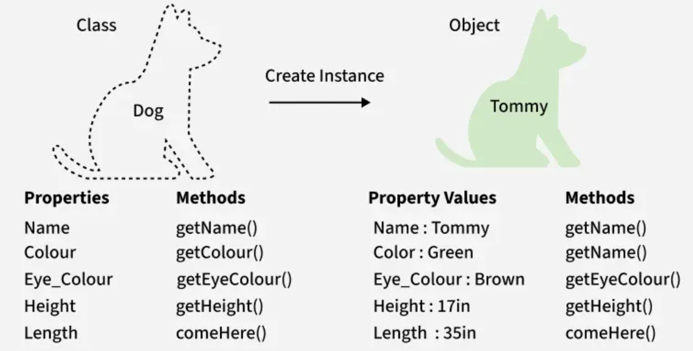
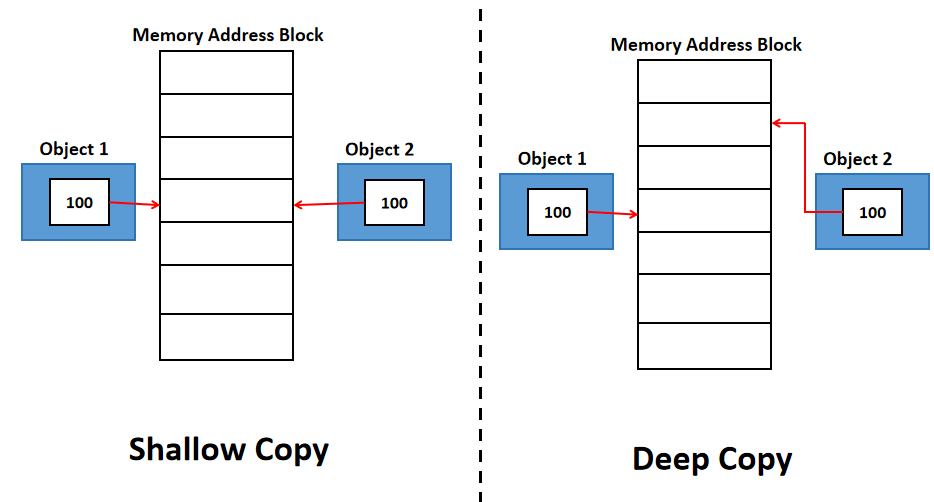

# C++ Classes

In `Object Oreinted Programming (OOP)`, classes and objects are basic concepts of that are used to represent real-world concepts and entities.

- `Class` is a **template to create objects having similar properties and behaviour**, or in other words, we can say that a class is a **blueprint for objects**.
- `Object` is **an instance of a class**. 

From the sample picture below, the animal type Dog is a class, while a particular dog named Tommy is an object of the Dog class.

</img>

For more information on concept of `OOP` in C++, may refer to this <a href="https://www.geeksforgeeks.org/cpp/object-oriented-programming-in-cpp/">link</a>

## Generic Structure of C++ Class

**Generic syntax to define a class in C++:**

```c++
class className 
{
    access_specifier:
        // data members
        //member functions
};
```

From the generic syntax above, you can see a class in C++ generally having `access specifier` and members (`data members` and `member functions`).

<br>

### `Data Members` in Class

Data members are those **variables defined inside a class**.

```c++
class className 
{
    int a; // int a is a data member
};
```

<br>

### `Member Functions` in Class

Members functions are **functions declared inside a class**, also referred to as a **member method**.

There are 2 ways to define member function in a class.

**Method #1:** Define member function in a class

```c++
class className
{
    void funcName()
    {
        // List actions in the function
    }
};
```

**Method #2:** Define member function outside a class

```c++
class className
{
    void funcName();
};

// NOTE:
// If member function is declared outside the class, function name should be:
// <class_Name>::<member_function_name>()
void className::funcName()
{
    // List actions in the function
}
```

<br>

### `Access Specifiers` in Class

In C++, `access specifiers` are keywords that **control the visibility and accessibility of class members** (`data members` and `member functions`).

They define which parts of a program can access specific members of a class, thereby enforcing encapsulation and data hiding.

<br>

#### 3 main access specifiers in C++ class

1) `public`

    - Members declared as `public` are **accessible from anywhere in the program**, both within the class and from outside the class using an object of that class
    - Public members **typically form the interface of a class, allowing interaction** with its functionality

2) `private`

    - Members declared as `private` are **only accessible from within the same class**
    - They **cannot be accessed directly from outside the class**, even by objects of that class
    - Private members are **typically used for internal implementation details** of a class, **promoting data hiding** and **preventing direct manipulation of internal state**


3) `protected`

    - Members declared as `protected` are **accessible within the same class and by derived (child) class**
    - They **cannot be accessed directly from outside the class or by unrelated classes**
    - Protected access is primarily **used in the context of `inheritance`**, allowing derived classes to access specific members of their base class while maintaining a level of encapsulation from external code 

In short, perspective of 3 different actors:

- `Class` itself: 

    - Can see and access any code inside the class itself, regardless of visibility or accessibility level

- `Derived class` (child class):

    - Can see and access only code inside a `public` and `protected` region
    - **More information on derived class, will be discussed in [`inheritance`](./08_Inheritance_and_Polymorphism.md#inheritance) chapter**

- `Object` of a class:

    - Can see and access only code inside `public` area

**NOTE:**

- If no access specifier is given in a `class`, the default visibility or access specifier for the class is `private`.

```c++
class className {
    // everything in here has private access by default
    // since no access specifier is given
};
```

- Another way to write a class is to write a `struct`, which has all members with `public` access specifier by default

```c++
struct className 
{
    // everything in here has public access by default
    // since struct has public access specifier by default
};
```

<br>

## C++ Objects

Assume class is done defined as mentioned in topic [above](#generic-structure-of-c-class), syntax to create new object as below:

```c++
className objectName;
```

Method to access members in a class:

```c++
objectName.dataMemberName; // To access data member

objectName.memberFunctionName(..); // To access member function

// Dot (.) operator is used to access members in a class
```

<br>

## `Constructors`

A constructor is a **`member function that has the same name` as the class**. 

The **purpose** of constructor is to **initialize an object of a class**. It constructs an object and can set values to data members.

If a class has a constructor, all objects of that class will be initialized by a constructor call. In short, **when an object is created, a code inside the constructor runs**.

**NOTE:** 

- Constructors are invoked when object initialization takes place. 
- They cannot be invoked directly

```c++
#include <iostream>

class className
{
    public:
        className()  // This is a sample constructor without any parameters
        {
            std::cout << "Constructor is called";
        }
};

int main()
{
    className obj1; // Invoke constructor when object is initialized

    return 0;
}
```

**EXTRAS:** Another fancy but useful method to prepare constructor outside class (especially a lot of parameters)

```c++
#include <iostream>

class className
{
    public:
        className(); // Constructor
};

className::className() // Constructor outside class
{
    // Initialization of parameters
}

int main()
{
    className obj1; // Invoke constructor when object is initialized

    return 0;
}
```

There are 4 main types of constructors in C++:

- `Default Constructor`
- `Parameterized Constructor`
- `Copy Constructor`
- `Move Constructor`

<br>

### `Default Constructor`

Default constructor is a **`constructor without parameters or with default parameters set`**.

**Example of default constructor without parameters:**

```c++
#include <iostream>

class MyClass
{
    public:
        MyClass() // Default constructor with no parameters
        {
        } 
};

int main()
{
    MyClass obj1; // Invoke a default constructor
    return 0;
}
```

**Example of default constructor with default parameters given:**

```c++
# include <iostream>

class MyClass
{
    public:
        int x, y;
        MyClass(int xx, int yy) // Default constructor with parameters
        {
            x = xx;
            y = yy;
        }
};

int main()
{
    MyClass obj1{1,2}; // Invoke default constructor with parameters
    std::cout << obj1.x << ", " << obj1.y; // Prints "1, 2"
}
```

**EXTRAS:**

Default constructor will be automatically generated even if user does not define one

```c++
#include <iostream>

// Class with no explicity defined constructors
class MyClass
{
    public: 
        // For here, even if user does not define any constructor
        // MyClass(){} constructor will be auto-generated here
};
// NOTE: If user has defined a constructor, the default constructor will not be auto-generated

int main()
{
    MyClass obj1; // Create object obj1
    return 0;
}
```

<br>

### `Parameterized Constructor`

Parameterized constructor allow us to pass arguments, but a better and more efficient way to initialize an object of a class

```c++
#include <iostream>

class MyClass
{
    public:
        int x, y;
        MyClass(int xx, int yy) : x{xx}, y{yy} // member initializer list ==> x = xx; y = yy
        {
        }

        // Or you can write as below for parameterized constructor, but above is much preferred
        /*
        MyClass(int xx, int yy) : x(xx), y(yy)
        {
        }
        */
};

int main()
{
    MyClass obj1{1,2}; // Invoke parameterized constructor
    std::cout << obj1.x << ", " << obj1.y; // Prints "1, 2"
}
```

<br>

### `Copy Constructor`

**If we do not supply our copy constructor**, the compiler generates a default copy constructor that performs so-called **`shallow copy`**.

However, we **need to define our own copy constructor** only **if an object has pointers or any runtime allocation** like a file handle, a network connection, etc.

<br>

#### Comparison between shallow copy and deep copy

- `Shallow copy` means that **only the pointers will be copied not the actual resources that the pointers are pointing to**. This can **lead to dangling pointers if the original object is deleted**.
- `Deep copy` is possible only with a user-defined `copy constructor`. In user-defined copy constructor, we **make sure that pointers (or references) of copied objects point to new copy of the dynamic resource allocated manually** in the copy constructor **using `new` operators**.

</img>

For more information on comparison between shallow and deep copy, can refer <a href="https://www.geeksforgeeks.org/cpp/shallow-copy-and-deep-copy-in-c/">here</a>

<br>

#### User-defined Copy Constructor

**Syntax to define copy constructor in a class:**

```c++
className (const ClassName& ref_obj)
{
    // Body of copy constructor
    // const is optional but added to avoid us from modifying object by mistake
}
```

**Sample implementation with copy constructor:**

- Without any pointer

```c++
#include <iostream>

class MyClass
{  
    public:
        int x, y;
        MyClass(int xx, int yy) : x{xx}, y{yy} // Parameterized constructor
        {
        }

        MyClass(const MyClass& ref_obj) : x{ref_obj.x}, y{ref_obj.y} // Copy constructor
        {
        }
};

int main()
{
    MyClass obj1{1,2};
    MyClass obj2 = obj1; // Invoke copy constructor

    std::cout << obj2.x << "; " << obj2.y; // Output ==>  1; 2

    return 0;
}
```

- WIth pointer

```c++
#include <iostream>

class MyClass
{  
    public:
        int x;
        int* y;
        MyClass(int xx, int yy) : x{xx}, y{new int{yy}} // Parameterized constructor
        {
        }

        MyClass(const MyClass& ref_obj) : x{ref_obj.x}, y{ new int {*ref_obj.y}} // Copy constructor
        {
        }
};

int main()
{
    MyClass obj1{1,2};
    MyClass obj2 = obj1; // Invoke copy constructor

    std::cout << obj2.x << "; " << *(obj2.y); // Output ==>  1; 2

    // This sample is still not a good practice with pointer, because delete pointer is not done right after the pointer is unused

    // Destructor will be discussed in later chapter
    return 0;
}
```

<br>

#### `Copy Assignment Operator`

**Syntax to define copy assignment operator in a class:**

```c++
className& operator=(const className& ref_obj)
{
    // Body of copy assignment operator
    return *this;
}
```

**Pseudocode to define user-defined copy asignment operator outside a class:**

```c++
class className
{
    public:
        className& operator=(const className& ref_obj);
};

// Define copy assignment operator outside the class
className& className::operator=(const className& ref_obj)
{
    // Implement the copy logic here
    return *this;
}
```

**Sample code line to invoke copy assignment operator:**

```c++
className obj_copyTo, obj2_copyFrom;
obj_copyTo = obj_copyFrom; // Invoke copy assignment operator
```

**Main difference between `copy constructor` and `copy assignment operator`:**

| Copy Constructor | Copy Assignment Operator |
|---|---|
| Makes a new memory storage every time it is called | Does not make new memory storage |
| Is called when a new object is created from an existing object, as a copy of the existing object | Is called when an already initialized object is assigned a new value from another existing object |

Pseudocode below shows the difference in defining the statement respectively:

```c++
MyClass t1, t2;
MyClass t3 = t1; // Invoke copy constructor
t2 = t1; // Invoke copy assignment operator
```

<br>

### `Move Constructor`

`Move semantics` (action of moving data from one object to the other) is achieved through a move constructor and move assignment operator.

Move operation is **efficient in terms of speed of execution, as we do not have to make copies**.

The object from which the data was moved is left in some valid but unspecified state. It **can be seen as stealing the resources from other objects**.

Move constructor accepts something called `rvalue reference` as an argument. The rvalue reference type is **T&&**, with `double reference symbols`.

**Syntax to define move constructor in a class:**

```c++
className(className&& ref_obj)
{
    // Body of move constructor
}
```

To cast something to an rvalue reference, we need to use `std::move` function as in sample pseudocode below.

```c++
#include <iostream>

class MyClass
{
    public:
        int x;
        MyClass(int xx) : x{xx} // Parameterized constructor
        {
        }
        MyClass(MyClass&& ref_obj) : x{std::move(ref_obj.x)} // Move constructor
        {
        }
};

int main()
{
    MyClass obj1{1};
    MyClass obj2 = std::move(obj1); // Invoke move constructor

    std::cout << obj1.x; // Output ==> 1

    return 0;
}
```

<br>

#### `Move Assignment Operator`

Move assignment operator acts very similar to [copy assignment operator](#copy-assignment-operator), except it is for [move constructor](#move-constructor).

**Syntax to define move assignment operator in a class:**

```c++
className& operator=(const className&& ref_obj)
{
    // Body of move assignment operator
    return *this;
}
```

**Sample code line to invoke move assignment operator:**

```c++
existing_obj = std::move(another_obj); // Invoke move assignment operator
```

<br>

### Operator Overloading

`Operator Overloading` in C++ is a feature that **allows you to redefine the way operators work for user-defined types (like classes)**.

It enables you to give special meaning to an operator when it is used with objects of a class.

Below are some commonly used operators (for arithmetic, binary, boolen, unary, comparison, compound, function and subscript):

- `+`, `-`, `*`, `/`, `%`
- `^`, `&`, `|`, `~`
- `!`
- `=`, `<` , `>`
- `==`, `!=`, `>=` `<=`
- `+=`, `-=`, `*=`, `/=`, `%=`
- `^=`, `&=`, `|=`
- `<<`, `>>`
- `<<=`, `>>=`
- `&&`, `||`
- `++`, `--`
- `,`
- `->`, `->*`
- `()`, `[]`

**Syntax of Operator Overloading:**

```c++
return_type operator op (arguments)
{
    // Function body
}
```

From the syntax above:

- `<return_type>` is the class name if you are doing in class
- `op` refers to the operator symbol
- You can refer to [copy assignment operator](#copy-assignment-operator) and [move assignment operator](#move-assignment-operator) to understand the method of implementation

For more information on operator overloading, may refer to below links:

- <a href="https://www.geeksforgeeks.org/cpp/operator-overloading-cpp/">Operator Overloading in C++</a>
- <a href="https://en.cppreference.com/w/cpp/language/operators.html">https://en.cppreference.com/w/cpp/language/operators.html</a>

<br>

## `Destructors`

Destructors are **invoked when an object goes out of scope or when a pointer to an object is deleted**.

We **should not call the destructor directly**.

Destructors are used to **clean up the allocated resources**.

The **signature** of the destructor **starts with a tidle `~` followed by the class name**, below is the example to define destructor in a class.

```c++
class className
{
    public:
        className() // Constructor
        {
            // Body for constructor
        }

        ~className() // Destructor
        {
            // Body for Destructor
        }
};
```

<br>

## Appendix

Reference links:

- <a href="https://www.geeksforgeeks.org/cpp/c-classes-and-objects/">C++ Classes and Objects</a>
- <a href="https://www.geeksforgeeks.org/cpp/difference-between-constructor-and-destructor-in-c/">Difference Between Constructor and Destructor in C++</a>
- <a href="https://www.geeksforgeeks.org/cpp/constructors-c/">Constructors in C++</a>