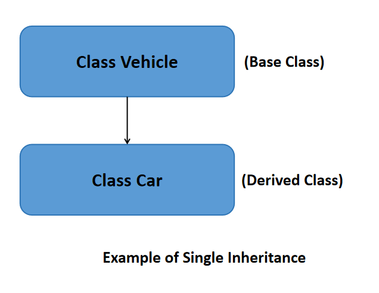
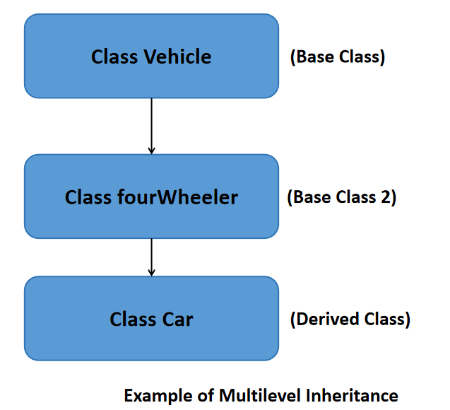
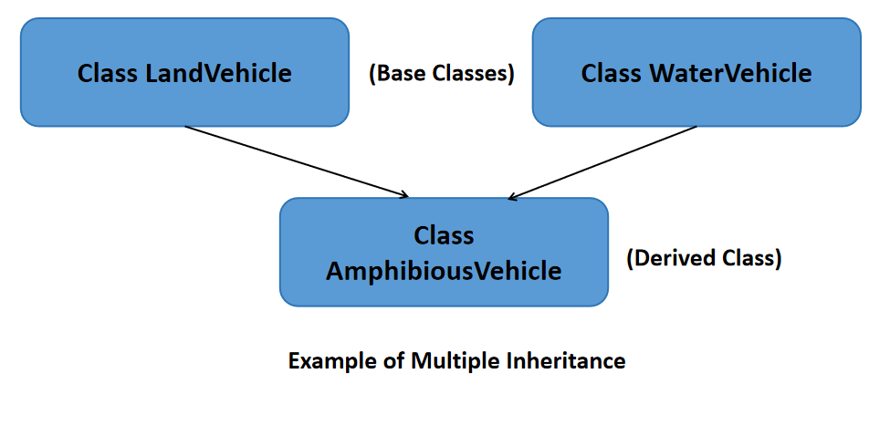
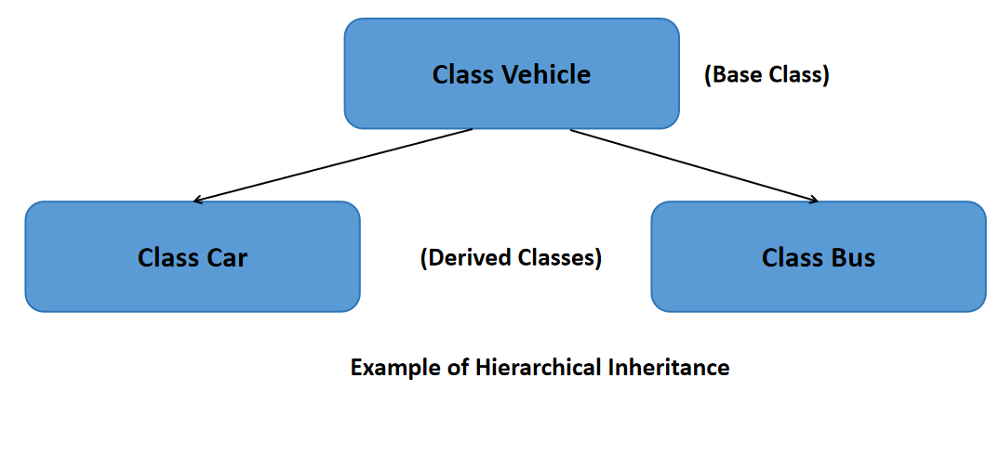
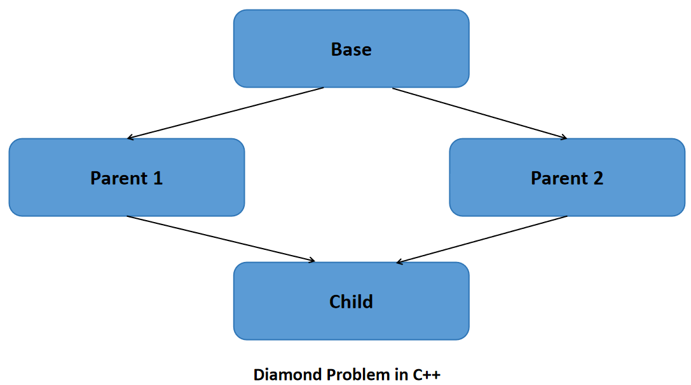

# C++ Classes &mdash; Inheritance & Polymorphism

This is the continued chapter from [C++ classes](./07_Classes.md).

`Inheritance` and `polymorphism` are some of the fundamental building blocks of object-oriented programming (`OOP`).

## Inheritance

Inheritance in the **capability of a class to derive properties and characteristics from the existing class**.

**Basic Syntax of Class Inheritance:**

```c++
class DerivedClass : mode_of_inheritance BaseClass 
{
    // Body of the derived class
};

// NOTE:

// DerivedClass ==> Class derived from existing class

// BaseClass ==> the existing master class

// mode_of_inheritance, can be:
// - public
// - protected
// - private

// EXTRAS:
// Statements below shows how you can call derived class in main function, for example

int main()
{
    DerivedClass obj1; // Derived class obj1 is defined
    return 0;
}
```

From the explanation of the syntax above, there are 3 modes of inheritance:

- `Public Inheritance Mode`
- `Protected Inheritance Mode`
- `Private Inheritance Mode`

No matter which modes of interitance mentioned above, the accessibility of inheritance access still stay the same as table below.

| Accessibility | Public Members | Protected Members | Private Members |
|:---:|:---:|:---:|:---:|
| Base Class <br> [**original existing class**] | Yes | Yes | Yes |
| Derived Class <br> [**Child class**] | Yes | Yes | No |
| Object | Yes | No | No |

In summary:

- `Base class` has **access to all `public`, `protected` and `private` members** in itself
- `Derived class` has **access only to both `public` and `protected` members** in base class
- `Object` has **access only to `public` members** in base class

<br>

### Modes of Inheritance

1) `Public Inheritance` [**Most widely used**]

    - Makes public members of the base class public in the derived class
    - Make the protected members of the base class remain protected in the derived class

```c++
//C++ Public Inheritance Example

#include <iostream>

class BaseClass // Main or base class
{
    private:
        int pvt = 1;
    protected:
        int prot = 2;
    public:
        int pub = 3;

        int getPVT(){return pvt;} // Function to access private member
        // This function is created, because public derived class cannot access to get private members
};

class PublicDerived : public BaseClass
{
    public:
        int getProt(){return prot;} // Function to access protected member from base class
        // This function is created, because object cannot access to get protected members
};

int main()
{
    PublicDerived obj1;
    std::cout << "Private = " << obj1.getPVT() << std::endl; // Output ==> Private = 1
    std::cout << "Protected = " << obj1.getProt() << std::endl; // Output ==> Protected = 2
    std::cout << "Public = " << obj1.pub << std::endl; // Output ==> Public = 3
    return 0;
}
```

2) `Protected Inheritance`

    - Makes the public and protected members of the base class protected in the derived class

```c++
//C++ Protected Inheritance Example

#include <iostream>

class BaseClass // Main or base class
{
    private:
        int pvt = 1;
    protected:
        int prot = 2;
    public:
        int pub = 3;

        int getPVT(){return pvt;} // Function to access private member
        // This function is created, because public derived class cannot access to get private members
};

class PublicDerived : protected BaseClass // all members in the derived class becomes protected members
{
    public:
        int getPub(){return pub;} // Function to access public member from base class
        // This function is created, because all memebers in this derived class are protected

        int getProt(){return prot;} // Function to access protected member from base class
        // This function is created, because object cannot access to get protected members

        int try_getPvt(){return BaseClass::getPVT();} // Function to access private member from base class
        // This function is created, because all memebers in this derived class are protected
};

int main()
{
    PublicDerived obj1;
    std::cout << "Private = " << obj1.try_getPVT() << std::endl; // Output ==> Private = 1
    std::cout << "Protected = " << obj1.getProt() << std::endl; // Output ==> Protected = 2
    std::cout << "Public = " << obj1.getPub() << std::endl; // Output ==> Public = 3
    return 0;
}
```

3) `Private Inheritance`

    - Makes the public and protected members of the base class private in the derived class

```c++
//C++ Private Inheritance Example

#include <iostream>

class BaseClass // Main or base class
{
    private:
        int pvt = 1;
    protected:
        int prot = 2;
    public:
        int pub = 3;

        int getPVT(){return pvt;} // Function to access private member
        // This function is created, because public derived class cannot access to get private members
};

class PublicDerived : private BaseClass // all members in the derived class becomes private members
{
    public:
        int getPub(){return pub;} // Function to access public member from base class
        // This function is created, because all memebers in this derived class are private

        int getProt(){return prot;} // Function to access protected member from base class
        // This function is created, because object cannot access to get protected members

        int try_getPvt(){return BaseClass::getPVT();} // Function to access private member from base class
        // This function is created, because all memebers in this derived class are private
};

int main()
{
    PublicDerived obj1;
    std::cout << "Private = " << obj1.try_getPVT() << std::endl; // Output ==> Private = 1
    std::cout << "Protected = " << obj1.getProt() << std::endl; // Output ==> Protected = 2
    std::cout << "Public = " << obj1.getPub() << std::endl; // Output ==> Public = 3
    return 0;
}
```

<br>

### Types of Inheritance in C++

There are 5 types of inheritances:

1) `Single Inheritance`

    - 1 base class is inherited by 1 derived class only
    - Examples given in [above sub-chapter](#modes-of-inheritance) are single inheritance, where only 1 derived class from the base class

    
    
```c++
// Example of single inheritance as per sample diagram above
#include <iostream>

class Vehicle
{
    public:
        Vehicle()
        {
            std::cout << "This is a Vehicle" << std::endl;
        }
};

// Sub class derived from a single base class
class Car : public Vehicle
{
    public:
        Car()
        {
            std::cout << "This Vehicle is Car" << std::endl;
        }
};

int main()
{
    Car obj1; // Creating obj1 of sub class will invoke the constructor of base classes

    // Results:
    /*
    This is a Vehicle
    This Vehicle is Car
    */

    return 0;
}
```

<br>

2) `Multilevel Inheritance`

    - Derived class is created from another derived class and that derived class can be derived from a base class or any other derived class. 
    - There can be any number of levels

    

```c++
// Example of multilevel inheritance as per sample diagram above
#include <iostream>

class Vehicle
{
    public:
        Vehicle()
        {
            std::cout << "This is a Vehicle" << std::endl;
        }
};

class fourWheeler : public Vehicle
{
    public:
        fourWheeler()
        {
            std::cout << "4 Wheeler Vehicles" << std::endl;
        }
};

class Car : public fourWheeler
{
    public:
        Car()
        {
            std::cout << "This 4 Wheeler Vehical is a Car" << std::endl;
        }
};

int main()
{
    Car obj1; // Creating obj1 of sub class will invoke the constructor of base classes

    // Results:
    /*
    This is a Vehicle
    4 Wheeler Vehicles
    This 4 Wheeler Vehical is a Car
    */
    return 0;
}
```

<br>

3) `Multiple Inheritance`

    - 1 derived class is inherited from more than 1 base class

    

```c++
// Example of multiple inheritance as per sample diagram above
#include <iostream>

class WaterVehicle
{
    public:
        WaterVehicle()
        {
            std::cout << "This is a WaterVehicle" << std::endl;
        }
};

class LandVehicle
{
    public:
        LandVehicle()
        {
            std::cout << "This is a LandVehicle" << std::endl;
        }
};

// sub class derived from more than 1 base classes
class AmphibiousVehicle : public WaterVehicle, public LandVehicle
{
    public:
        AmphibiousVehicle()
        {
            std::cout << "This is an AmphibiousVehicle" << std::endl;
        }
};

int main()
{
    AmphibiousVehicle obj1; // Creating obj1 of sub class will invoke the constructor of base classes

    // Results:
    /*
    This is a WaterVehicle
    This is a LandVehicle
    This is an AmphibiousVehicle
    */

    return 0;
}
```

<br>

4) `Hierarchical Inheritance`

    - More than 1 derived classes is inherited from a single base class

    

```c++
// Example of hierarchical inheritance as per sample diagram above
#include <iostream>

class Vehicle
{
    public:
        Vehicle()
        {
            std::cout << "This is a Vehicle" << std::endl;
        }
};

class Car : public Vehicle
{
    public:
        Car()
        {
            std::cout << "This Vehicle is Car" << std::endl;
        }
};

class Bus : public Vehicle
{
    public:
        Bus()
        {
            std::cout << "This Vehicle is Bus" << std::endl;
        }
};

int main()
{
    Car obj1;
    Bus obj2;

    // Creating obj1 & obj2 of sub classes will invoke the constructor of base classes

    // Results:
    /*
    This is a Vehicle
    This Vehicle is Car
    This is a Vehicle
    This Vehicle is Bus
    */

    return 0;
}
```

<br>

5) `Hybrid Inheritance`

    - Implemented by combining more than one type of inheritance

<br>

6) `Multipath Inheritance`

    - 1 special case of `hybrid inheritance`
    - A class is derived from 2 base classes, and these 2 base classes in turn are derived from 1 common base class
    - An ambiguity can arise in this type of inheritance in the most derived class
    - This problem is also called `diamond problem` due to the diamond shape formed in the UML inheritance diagram

    **Diamond Problem:**

    - Diamond problem is an **ambiguity error** that arises in multiple inheritance **when a derived class inherits from two or more base classes that share a common ancestor**
    - This results in the **inheritance hierarchy forming a `diamond shape`**, hence the name "Diamond Problem"
    - Ambiguity arises because the derived class has multiple paths to access members or methods inherited from the common ancestor, leading to **confusion during method resolution and member access**

    

    <br>

    To resolve `diamond problem`, use `virtual inheritance` as the **best practice** to **ensure there is only one instance of the common base class**, eliminating ambiguity, as in sample code below:

```c++
// C++ Program to illustrate the use of virtual inheritance
// to resolve the diamond problem in multiple inheritance
#include <iostream>
using namespace std;

// Base class
class Base {
public:
    void fun() { cout << "Base" << endl; }
};

// Parent class 1 with virtual inheritance
class Parent1 : virtual public Base {
public:
};

// Parent class 2 with virtual inheritance
class Parent2 : virtual public Base {
public:
};

// Child class inheriting from both Parent1 and Parent2
class Child : public Parent1, public Parent2 {
};

int main()
{
    Child* obj = new Child();
    obj->fun(); // No ambiguity due to virtual inheritance

    // Output ==> Base

    return 0;
}  
```

<br>

## Appendix

Reference link:

- <a href="https://www.geeksforgeeks.org/cpp/inheritance-in-c/">Inheritance in C++</a>
- <a href="https://www.geeksforgeeks.org/cpp/cpp-polymorphism/">C++ Polymorphism</a>