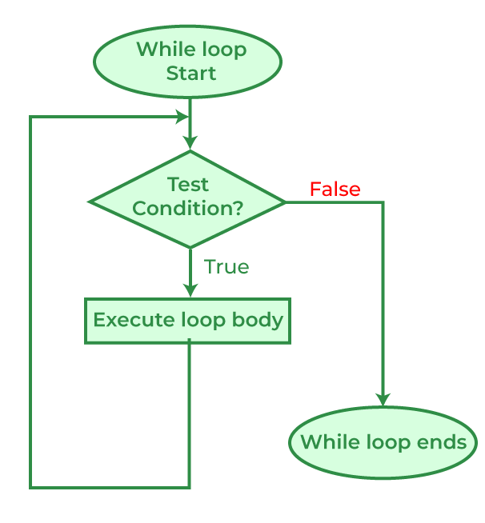

# While Loop Statement in C Programming

```c
    while(<condition>){
        // Body of While loop
    }
```

<br>



## Extras
<strong> while(1) </strong> = <strong> while(True) </strong> = <strong> infinite loop </strong>

<strong><u> NOTE: </strong></u><br>
To terminate the infinite loop, you need to add in one <strong> if statement </strong> with a `break;` statement