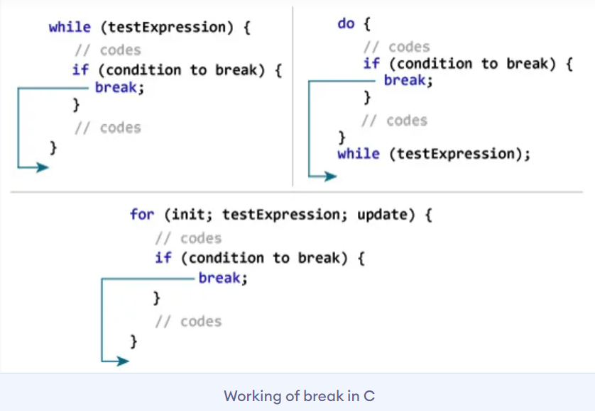
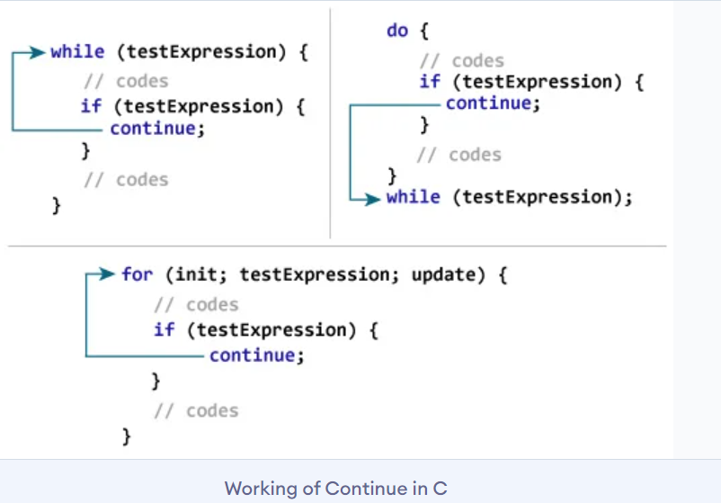

# Break & Continue Statement in C Programming

## Break Statement

The `break` statement ends the loop immediately when it is encountered. Its syntax is:
```
    break;
```

### How break statement works?



<br>

## Continue Statement

The `continue` statement skips the current iteration of the loop and continues with the next iteration. Its syntax is:
```
    continue;
```

### How continue statement works?



<br>

