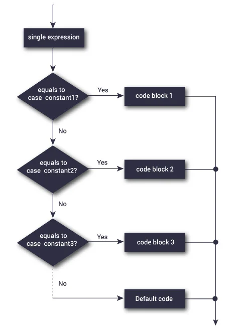

# Switch Case Statement in C Programming

```c
    switch(<expression>)
    {
        case <constant1>:
            // Statements for constant1
            break;
        case <constant2>:
            // Statements for constant2
            break;
        .
        .
        .
        default:
            // Default statements
            break;
    }
```

<br>



**NOTE:**

- There are no break statements, the code will proceed to execute the code in the next case statement regardless of the case value.
- Therefore, it's a good practice to put break statements in all the `case` and `default` switches.