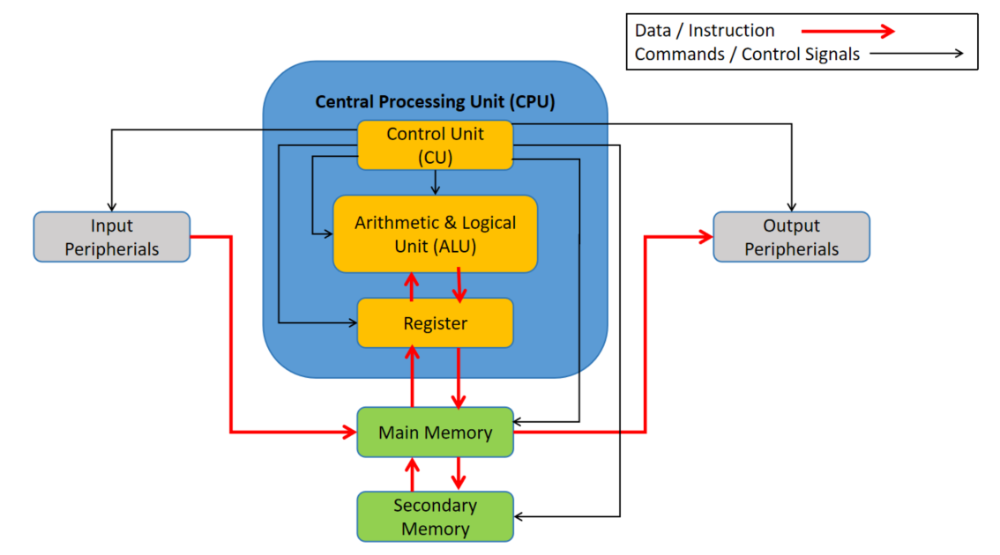

# Introduction

## Computer Organization VS Computer Architecture

### Computer Organization

- Deals with **structural relationship**
- Operational attributes are linked together and contribute to realize the architectual specification

### Computer Architecture

- Deals with **functional behaviour** of computer systems
- **Design implementation** for various parts of computer

## Basics of Computer Architecture

`Computer architecture` is the **design of computers**, including their **instruction sets**, **hardware components** and **system organization**.

There are 2 major parts of architecture:

1) `Instruction Set Architecture (ISA)`

    - Determines how machine language programs will interact with the computer

2) `Hardware Set Architecture (HSA)`

    - Deals with computer's major hardware subsystems, e.g. CPU, storage, I/O peripherials, etc

## Components of Computer

</img>

## Classifications of Computer Architecture

There are 2 major categories of computer architecture:

1) `Von Neumann Architecture`

    - Also known as Princeton Architecture

2) `Non-Von Neumann Architecture`

    - Harvard Architecture
    - Modified Harvard Architecture

There are 4 major categories of computer systems:

- Single-instruction, single-data (`SISD`) systems
- Single-instruction, multiple-data (`SIMD`) systems
- Multiple-instruction, single-data (`MISD`) systems
- Multiple-instruction, multiple-data (`MIMD`) systems

The above categories are known as `Flynn's taxonomy`