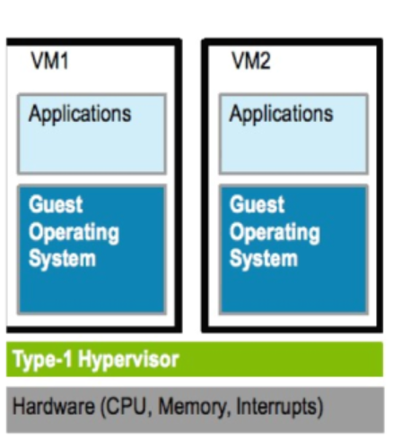
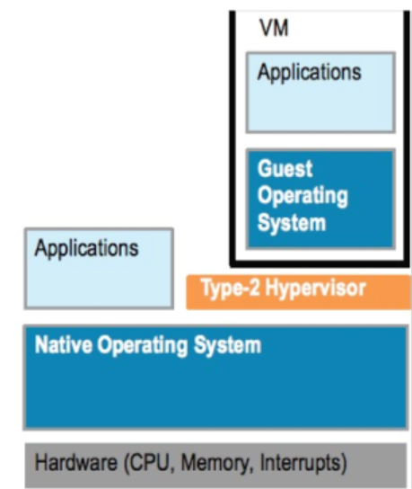

# Virtualization 

Virtualization allows one single physical machine to run multiple simulated environments (virtual machines or VMs)

## Common Terminologies

| Terminology | Explanation |
| :---: | ---|
| Host OS | Operating System of the Physical Machine |
| Guest OS | Operating System of the Virtual Machine (Guest Machine) |
| VM | Virtual Machine |
| Snapshot | A point-in-time capture of a virtual machine's state, including its operating system, applications, and data. This allows you to revert the VM to a specific configuration if needed, like before a software update or configuration change |
| Hypervisor | A software that you can use to run multiple virtual machines on a single physical machine |

## Types of Hypervisor

### Type 1 Hypervisor

- Bare Metal
- Runs as a Base OS, installed on physical machine
- e.g. VMware esxi, Xen Hypervison, Microsoft Hyper-V hypervisor

### Type 2 Hypervisor

- Runs as a software on Host OS of the physical machine
- e.g. Oracle virtualbox, VMware server

