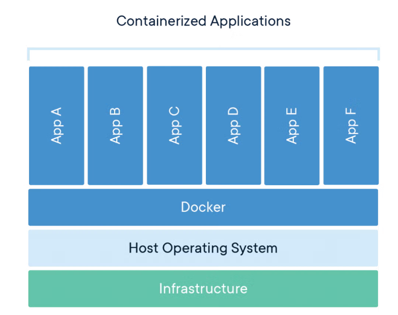

# Containerization

Containerization is the `process of packaging an application and all its dependencies into a portable, self-sufficient unit` called a **container**.

## What is Container?

A `container` is a standard unit of software that **packages up code and all its dependencies** so the **application runs quickly and reliably from one computing environment to another**.

`Docker container image` is a **lightweight, standalone, executable package of software** that includes **everything needed to run an application**: code, runtime, system tools, system libraries and settings.

Container images become containers at runtime and in the case of Docker containers &mdash; images become containers when they run on Docker engine.

 

Containers **isolate software from its environment** and **ensure that it works uniformly despite differences for instance between development and staging**.

Docker containers that run on Docker Engine:

- **Standard**

    - Docker created the industry standard for containers, so they could be portable anywhere

- **Lightweight**

    - Containers share the machine's OS system kernel and therefore do not require an OS per application, driving higher server efficiencies and reducing server and licensing costs

- **Secure**

    - Applications are safer in containers and Docker provides the strongest default isolation capabilities in the industry

## Container VS Virtual Machine (VM)

Containers and virtual machines **have similar resource isolation and allocation benefits**, but **function differently**, because:

- Containers virtualize the operating system instead of hardware
- Containers are more portable and efficient

Sub-chapters below shows the difference between containers and virtual machines.

### Containers

- Abstraction at the app layer that packages code and dependencies together

- Multiple containers can run on the same machine and share the OS kernel with other containers, each running as isolated processes in user space

- Take up less space than VMs (container images are typically tens of MBs in size)

- Can handle more applications and require fewer VMs and Operating Systems

### Virtual Machines

- Abstraction of physical hardware turning one server into many servers

- The hypervisor allows multiple VMs to run on a single machine

- Each VM includes a full copy of an operating system, the application, necessary binaries and libraries &mdash; taking up tens of GBs

- Can also be slow to boot