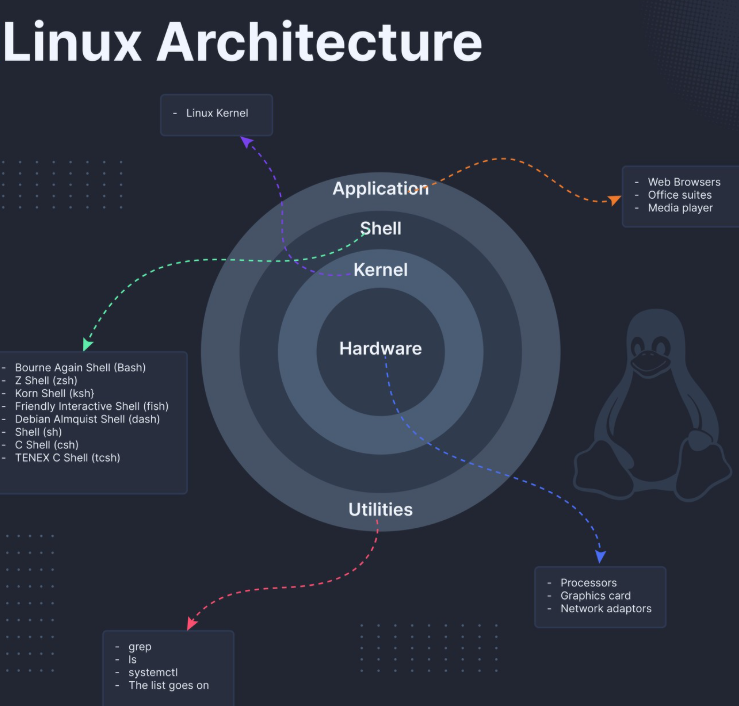

# Linux

## History of Linux

Click this link to know the full history of Linux: <a href="https://en.wikipedia.org/wiki/History_of_Linux">History of Linux</a>

## What is Open Source?

Open source software is software with source code available to all with 4 main freedoms:

- Freedom to run the program for any purpose
- Freedom to study and modify the source code
- Freedom to redistribute the program
- Fredom to create derivative programs

Many open-source licenses exist with different particulars

## Linux Principles

- Everything is considered as a file (including hardware)
- Small single purpose programs
- Ability to chain programs together for complex operations
- Avoid captive user interface
- Configuration data stored in text file

## Why Linux?
- Open source
- Huge community support
- Support wide variety of hardware
- Customizable
- Most servers run on Linux
- Easy to run automation
- Secure Operating System

## Architecture of Linux

## Some Important Directories in Linux

- Home Directories: `/root` , `/home/<USERNAME>`
- User Executable: `/bin` , `/usr/bin` , `/usr/local/bin`
- System Executable: `/sbin` , `/usr/sbin` , `/usr/local/sbin`
- Other Mountpoints: `/media` , `/mnt`
- Configuration: `/etc`
- Temporary Files: `/tmp`
- Kernels and Bootloader: `/boot`
- Server Data: `/var` , `/srv`
- System Information: `/proc` , `/sys`
- Shared Libaries: `/lib` , `/usr/lib` , `/usr/local/lib`

## Popular Linux distros

### Popular Desktop Linux OS

- Ubuntu Linux
- Linux Mint
- Arch Linux
- Fedora
- Debian
- OpenSuse

### Popular Server Linux OS

- Red Hat Enterprise Linux (RHEL)
- Ubuntu Server
- CentOS
- SUSE Enterprise Linux

### Most used Linux distros currently in IT industry

- RPM based: RHEL, CentOS, Oracle Linux
- Debian based: Ubuntu Server, Kali Linux

### RPM vs Debian

| **Software Package Format** | **Explanation** | **Example** |
|:---:|---|---|
| Debian based softwares (DEB or .deb)| DEB is the extension of the Debian software package format and the most often used name for such binary packages.    DEB was developed by Bedian. | **Example**: Google chrome software    **Package name**: google-chrome-stable_current_amd64.**deb**    **Installation**: dpkg -i google-chrome-stable_current_amd64.**deb** |
| Red Hat based softwares (RPM or .rpm)| The name RPM variosly refers to the .rpm file format, files in this format, software packaged in such files,a nd the package manager itself.    RPM was intended primarily for Linux distributions; the file format is the baseline package format of the Linux Standard Base.    RPM was developed by Community & **Red Hat**. | **Example**: Google chrome software    **Package name**: google-chrome-stable-57.0.2987.133-1.x86_64.**rpm**    **Installation**: rpm -ivh google-chrome-stable-57.0.2987.133-1.x86_64.**rpm** |

**NOTE: You will also encounter different commands, packages and service names while using both kinds of distros.**

### Wikipedia on list of Linux distributions

Wikipedia link: <a href="https://en.wikipedia.org/wiki/List_of_Linux_distributions">List of Linux distributions</a>