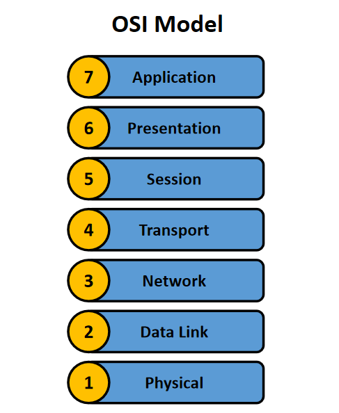
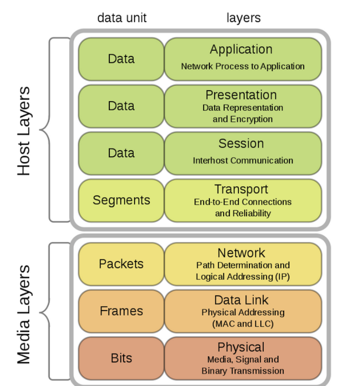
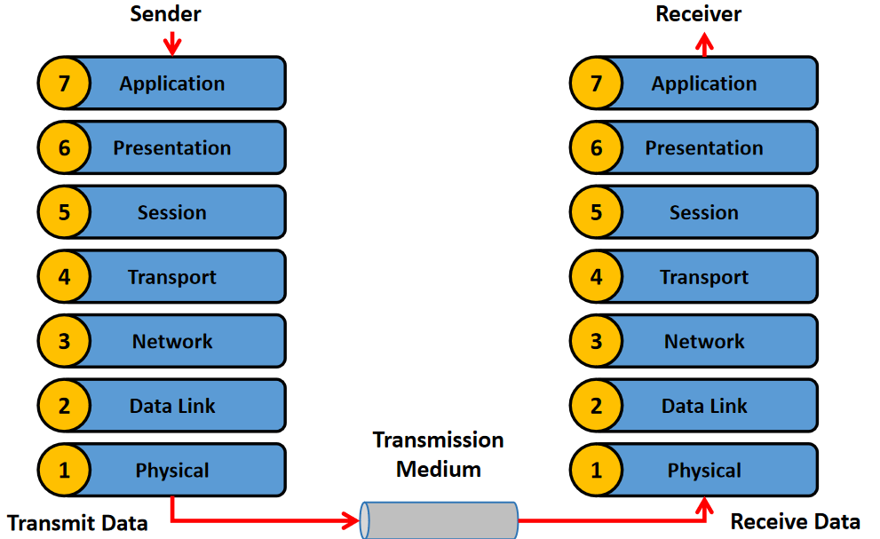

# Computer Networking

Computer networking is the practice of **connecting two or more computing devices to share data and resources**, using physical cables or wireless connections and a set of rules called communication protocols.

## OSI Model (Open Systems Interconnection Model)

OSI model is a **conceptual framework created by the `ISO (International Organization of Standardization)`**, that **standardizes network communication** by dividing it into 7 distinct layers, each with specific functions.

### 7 layers of OSI Model

 

Each layer handles a specific function in the communication process, working from the bottom up (or top down) to ensure data gets from a sender to a receiver

| Layer Name | Layer Number | Function |
|:---:|:---:|---|
| `Physical Layer` | 1 | Deals with the physical transmission of data, like cables, connectors and electrical signals |
| `Data Link Layer` | 2 | Manages data transfer between two directly connected nodes, handling error detection and control |
| `Network Layer` | 3 | Responsible for logical addressing, routing data packets across different networks |
| `Transport Layer` | 4 | Manages end-to-end data delivery, ensuring reliability and flow control between applications |
| `Session Layer` | 5 | Establishes, maintains, and terminates communication sessions between applications |
| `Presentation Layer` | 6 | Translates, encrypts, and compresses data to ensure it's in a format the application can understand |
| `Application Layer` | 7 | Provides network services directly to the user applications, such as email and file transfers |

 

The basic elements of a layered model are:

1) Services

    - Sets of actions that a layer offers to another (higher) layer

2) Protocols

    - Sets of rules that a layer uses to exchange information

3) Interfaces

    - Communication between the layers

### Detailed Diagram of OSI Model Layers

 

- `Host layers` (Top 4 layers) are **concerned with data itself** and how it is **processed and presented to end users**

- `Media layers` (Bottom 3 layers) focus on **actual physical transmission** and **trasnfer data across the network**

### Data Flow in OSI Model (between sender & receiver)

