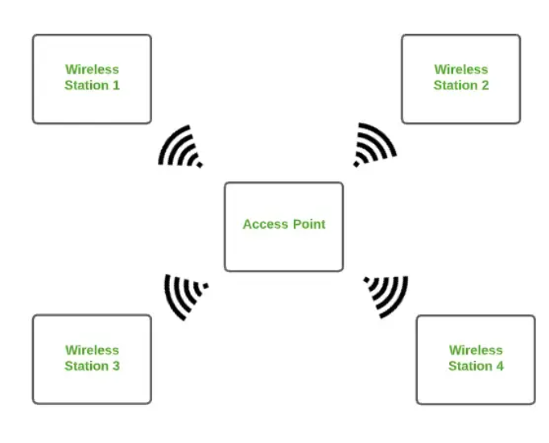
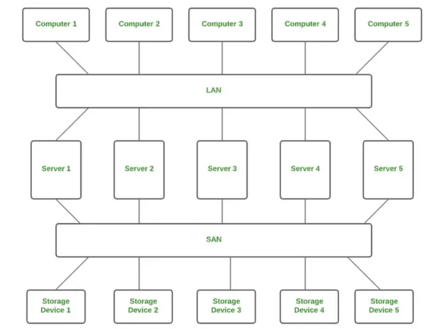
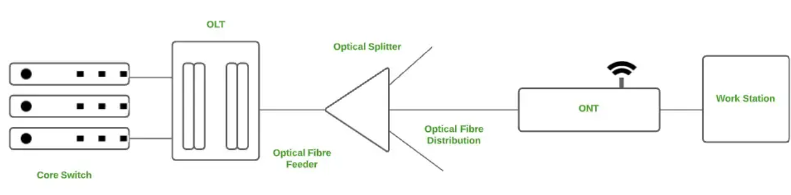
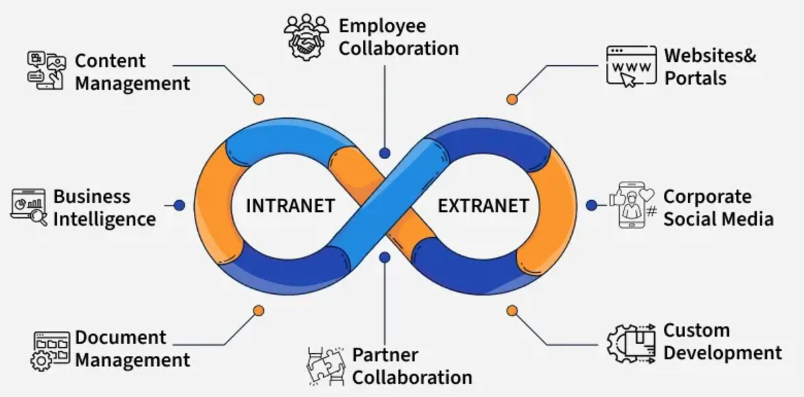

# Classification of Computer Networks

## Classification Based on `Geographical Area`

1) **Personal Area Network (PAN)**

    - Most basic type of computer network

    - Connect devices within a short range, typically around one person

    - Offers network range of 1 to 10 meters from person to device  providing communication

    - Transmission speed is very high with easy maintenance and very low cost

    - Example of PAN:

        - Bluetooth connection between a phone and wireless earbuds
        - Infrared communication between TV and remote
    
    

2) **Local Area Network (LAN)**

    - Most frequently used network

    - Computer network that connects computers through a common communication path, contained with a limited area, that is, locally

    - Encompasses two or more computers connected tover a server

    - 2 important technologies involved in LAN are Ethernet and Wi-Fi

    - Ranges up to 2km

    - Transmission speed is very high with easy maintenance and low cost

    - Example of LAN:

        - Wi-Fi in a home or school
        - Wired LAN in a company's office
    
    

3) **Campus Area Network (CAN)**

    - Bigger than LAN but smaller than a MAN

    - Usually used in places like a school or colleges

    - Covers a limited geographical area that is, it spreads across several buildings within the campus

    - Mainly use Ethernet technology with a range of few kilometers

    - Transmission speed is very high with a moderate maintenance cost and moderate cost

    - Example of CAN:

        - Networks that cover schools, colleges, buildings, etc
    
    

4) **Metropolitan Area Network (MAN)**

    - Larger than a LAN but smaller than a WAN

    - Connects computers over a geographical distance through a shared communication path over a city, town, or metropolitan area

    - Mainly uses FDDI, CDDI, and ATM as the technology with a range from 5km to 50km

    - Transmission speed is average

    - Difficult to maintain and it comes with a high cost

    - Example of MAN:

        - Networking in towns, cities, a single large city, a large area within multiple buildings, etc
    
    

5) **Wide Area Network (WAN)**

    - Connects computers over a large geographical distance through a shared communication path

    - Not restrained to a single location but extends over many locations

    - Can also be defined as a group of local area networks (LANs) that communicate with each other with a range above 50km

    - Here we use Leased-Line & Dial-up technology

    - Transmission speed is very low and it comes with very high maintenance and very high cost

    - Example of WAN:

        - Internet (largest WAN)
        - Banking networks linking global branches
    
    

## Classification Based on `Transmission Technology`

1) **Wireless Local Area Network (WLAN)**

    - Acts as a local area network but make use of wireless network technology like Wi-Fi

    - Doesn't allow devices to communicate over physical cables like in LAN but allow devices to communicate wirelessly

    

2) **System Area Network (SAN)**

    - Designed to connect high-performance computers within a localized, high-speed environment, such as in data centers or supercomputing facilities

    - Provides access to block-level data storage

    - Example of SAN:

        - A network of disks accessed by a network of servers
    
    

3) **Passive Optical Local Area Network (POLAN)**

    - Computer network that is an alternative to a LAN

    - Uses optical splitters to split an optical signal from a single strand of single-mode optical fiber to multiple signals to distribute users and devices

    - In short, POLAN is a point to multipoint LAN architecture

    

## Classification Based on `Ownership and Access Control`

1) **Private Network**

    - Networks completely owned and managed by a single organization or individual 

    - The owner controls who can connect, what they can do, and how data moves within the network

    - Since there is no outside access, they are highly secure and reliable, often protected by firewalls and strict policies

    - Example of private network:

        - A company's internal office network (Intranet)
        - School or college campus networks
        - Hospital systems storing patient data

2) **Public Network**

    - Networks open to general public and are usually provided by Internet Service Providers (ISPs) or businesses in public places

    - Offer basic or no authentication, making them less secure and vulnerable to attacks if not used carefully

    - Example of public network:

        - Public Wi-Fi at cafes or airports
        - Free hotspots in city centers
        - Internet (the largest public network)

3) **Hybrid Network**

    - Blends private and public access, offering flexibility and role-based access control

    - Some parts are restricted (like internal systems), while others are open (like guest Wi-Fi)

    - This setup is useful in environments where different users need different access levels

    - Example of hybrid network:

        - A university network with private access for staff and students, and limited access for guests

## Internetwork

 

An internetwork is a **setup where two or more networks (like LANs or WANs) are interconnected using routers or gateways**, allowing communication between them.

This process is called internetworking.

There are two main types:

1) **Intranet**

    - A private network used within an organization

    - Allows employees to access internal tools, documents and systems securely

    - Not available to the public, and typically uses private IP addreses

    - Example of Intranet:

        - Company HR portals
        - Internal knowledge bases
        - Staff-only communication tools

2) **Extranet**

    - Extension of the intranet that provides limited, secure access to outsiders such as partners, vendors or clients

    - Used to collaborate across organization while maintaining internal security

    - Example of Extranet:

        - Supplier portals
        - Client dasboards for project updates
        - Partner login systems for shared services

## Appendix

Reference links:

- <a href="https://www.geeksforgeeks.org/computer-networks/types-of-computer-networks/">Types of Computer Networks</a>