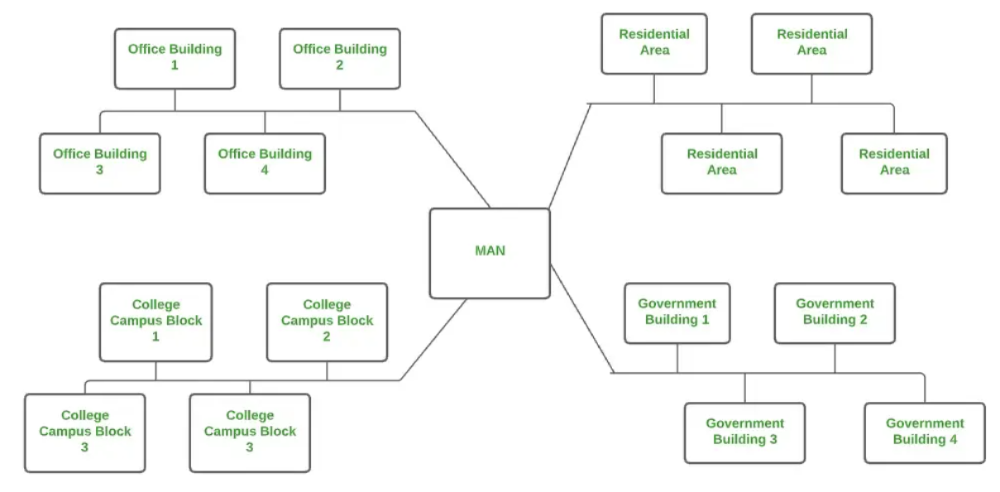

# Classification of Computer Networks

## Classification Based on `Geographical Area`

1) **Personal Area Network (PAN)**

    - Most basic type of computer network

    - Connect devices within a short range, typically around one person

    - Offers network range of 1 to 10 meters from person to device  providing communication

    - Transmission speed is very high with easy maintenance and very low cost

    - Example of PAN:

        - Bluetooth connection between a phone and wireless earbuds
        - Infrared communication between TV and remote
    
    

2) **Local Area Network (LAN)**

    - Most frequently used network

    - Computer network that connects computers through a common communication path, contained with a limited area, that is, locally

    - Encompasses two or more computers connected tover a server

    - 2 important technologies involved in LAN are Ethernet and Wi-Fi

    - Ranges up to 2km

    - Transmission speed is very high with easy maintenance and low cost

    - Example of LAN:

        - Wi-Fi in a home or school
        - Wired LAN in a company's office
    
    

3) **Campus Area Network (CAN)**

    - Bigger than LAN but smaller than a MAN

    - Usually used in places like a school or colleges

    - Covers a limited geographical area that is, it spreads across several buildings within the campus

    - Mainly use Ethernet technology with a range of few kilometers

    - Transmission speed is very high with a moderate maintenance cost and moderate cost

    - Example of CAN:

        - Networks that cover schools, colleges, buildings, etc
    
    

4) **Metropolitan Area Network (MAN)**

    - Larger than a LAN but smaller than a WAN

    - Connects computers over a geographical distance through a shared communication path over a city, town, or metropolitan area

    - Mainly uses FDDI, CDDI, and ATM as the technology with a range from 5km to 50km

    - Transmission speed is average

    - Difficult to maintain and it comes with a high cost

    - Example of MAN:

        - Networking in towns, cities, a single large city, a large area within multiple buildings, etc
    
    

5) **Wide Area Network (WAN)**

    - Connects computers over a large geographical distance through a shared communication path

    - Not restrained to a single location but extends over many locations

    - Can also be defined as a group of local area networks (LANs) that communicate with each other with a range above 50km

    - Here we use Leased-Line & Dial-up technology

    - Transmission speed is very low and it comes with very high maintenance and very high cost

    - Example of WAN:

        - Internet (largest WAN)
        - Banking networks linking global branches
    
    

## Appendix

Reference links:

- <a href="https://www.geeksforgeeks.org/computer-networks/types-of-computer-networks/">Types of Computer Networks</a>