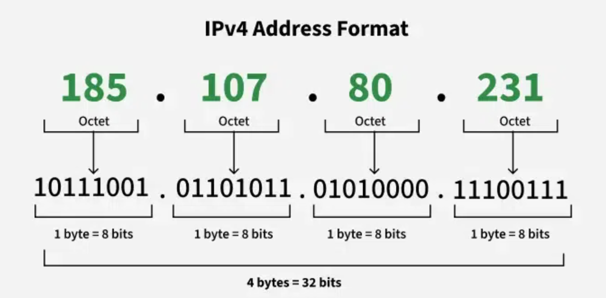

# Network IP Address

## What is an IP Address?

IP address, or Internet Protocol address, is a **unique string of numbers assigned to each device** connected to a computer network that **uses Internet Protocol** for communication.

It **serves as an identifier** that **allows devices to send and receive data over the network**, ensuring that this data reaches the correct destination.

## Types of IP Address

IP addresses can be classified in several ways based on their structure, purpose, and the type of network they are used in.

### Based on `Addressing Scheme` (IPv4 vs IPv6)

1) **IPv4**

    - The most common form of IP address

    - Consists of four sets of numbers separated by dots, where each set of numbers can range from 0 to 255

        - This format can support over 4 billion unique addresses

        - IPv4 address is broken down into 4 octets as shown in the sample diagram below, where each octet represents 8 bits or a byte, can take a value from 0 to 255 [28 = 256 combinations]

        
    
    - Each part of the IP address can indicate various aspects of the network configuration, from the network itself to the specific device within that network

        - For most cases, the network part of the address is represented by the first one to three octets, while the remaining section identifies the host (device)

2) **IPv6**

    - Created to deal with shortage of IPv4 addresses

    - Use 128 bits instead of 32, offering a vastly greater number of possible addresses

    - These addresses are expressed as 8 groups of four hexademical digits, where each group representing 16 bits and seperated by colon (`:`)

For more detailed information on the comparison, may refer to this <a href="https://www.geeksforgeeks.org/computer-networks/differences-between-ipv4-and-ipv6/">article</a>.

### Based on `Usage` (Public VS Private)

1) **Public IP Addresses**

    - Assigned to every device that directly accesses the internet

    - Unique across the entire internet

    - Key characteristics and uses of public IP addresses:

        - **Uniqueness:** 
        
            - Each public IP address is globally unique 
            - No two devices on the internet can have the same public IP address at the same time.

        - **Accessibility:**

            - Devices with a public IP address can be accessed directly from anywhere on the internet, assuming no firewall or security settings block the address

        - **Assigned by ISPs:**

            - Public IP addresses are assigned by Internet Service Providers (ISPs)

            - When you connect to the internet through an ISP, your device or router receives a public IP address

        - **Types:**

            - Public IP addresses can be static (permanently assigned to a device) or dynamic (temporary assigned and can change over time)

2) **Private IP Addresses**

    - Used within private networks (such as home networks, office networks, etc) and are not routable on the internet

    - Devices with private IP addresses cannot directly communicate with devices on the internet without a translating mechanism like a router performing Network Address Translation (NAT)

    - Key features of private IP addresses:

        - **Not globally unique:**

            - Private IP addresses are only required to be unique within their own network

            - Different private networks can use the same range of IP addresses without conflict

        - **Local communication:**

            - These addresses are used for communication between devices within the same network

            - They cannot be used to communicate directly with devices on the internet

        - **Defined ranges:**

            - The Internet Assigned Numbers Authority (IANA) has reserved specific IP address ranges for private use:

                - **IPv4:**

                    - 10.0.0.0 to 10.255.255.255 [Class A]
                    - 172.16.0.0 to 172.31.255.255 [Class B]
                    - 192.168.0.0 to 192.168.255.255 [Class C]

                - **IPv6:**

                    - Addresses starting with FD or FC

### Based on `Assignment Method` (Static VS Dynamic)

1) **Static IP Addresses**

    - Permanently assigned to a device, typically important for servers or devices that need a constant address

    - Reliable for network services that require regular access such as websites, remote management

2) **Dynamic IP Addresses**

    - Temporarily assigned from a pool of available addresses by the Dynamic Host Configuration Protocol (DHCP)

    - Cost-effective and efficient for providers, perfect for consumer devices that do not require permanent addresses

For more information on the comparison, please refer to this <a href="https://www.geeksforgeeks.org/computer-networks/difference-between-static-and-dynamic-ip-address/">article</a>

## Appendix

Reference link:

- <a href="https://www.geeksforgeeks.org/computer-science-fundamentals/what-is-an-ip-address/">What is an IP Address?</a>