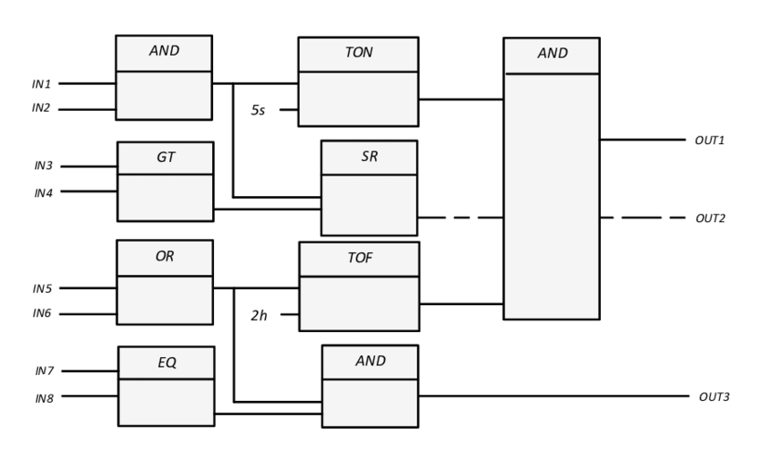

# Programmable Logic Controller [PLC]

## Overview of PLC System

 

## 5 Common PLC Programming Languages

1) Ladder Logic Diagram (LLD)
    - Ladder logic can be scanned by PLCs either in horizontal formats or in vertical formats.
    - Sample picture:  
        
        
     

2) Sequential Function Chart (SFC)
    - Sequential Function Chart (SFC) language is a method of programming complex control systems
    - It uses basic building blocks that run their own sub-routines
    - Program files are written in other programming languages
    - SFC divides large and complicated programming tasks into smaller and more manageable tasks.
    - Sample picture:  
        

     

3) Function Block Diagram (FBD)
    - It describes functions between input and output variables.
    - The function, represented by blocks, connects input and output variables
    - FBD is useful in depicting algorithms and logic from interconnected controls systems
    - Sample picture:  
        

     

4) Structured Test (ST)
    - Structured Test (ST) is a high-level language that uses sentence commands.
    - In ST, programmers can use "if/then/else", "SQRT", or "repeat/until" statements to create programs.
    - Sample picture:  
        

     

5) Instruction List (IL)
    - Instruction List (IL) is a low-level languages with functions and variables defined by a simple list
    - Program control is done by jump instructions and sub-routines with optional parameters
    - Sample picture:  
        

     

