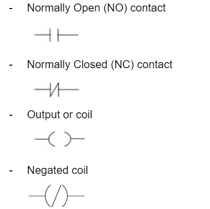

# Ladder Logic Diagram (LLD)

## How to read ladder logic programming flow

1) Read from left to right
2) Read from top to bottom
3) The horizontal line is called rung
4) The vertical line is called rail

 

## PLC Ladder Logic Symbols

Below are the most commonly used symbols: 

 

Apart from the most commonly used LLD symbols above, there are more symbols where you can study and understand via Internet.