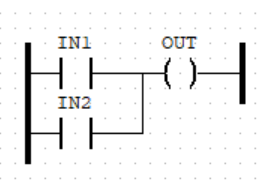
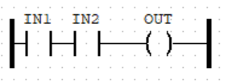
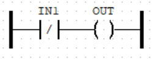
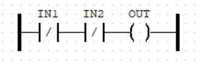
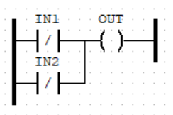
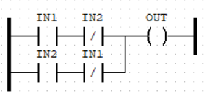
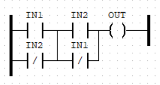

# Logic Gates Designs with PLC Ladder Diagram

Below are the designs of logic gates using PLC ladder diagram.

 

## OR Gate

| IN1 | IN2 | OUT |
| --- | --- | --- |
|  0  |  0  |  0  |
|  0  |  1  |  1  |
|  1  |  0  |  1  |
|  1  |  1  |  1  |

 

## AND Gate

| IN1 | IN2 | OUT |
| --- | --- | --- |
|  0  |  0  |  0  |
|  0  |  1  |  0  |
|  1  |  0  |  0  |
|  1  |  1  |  1  |

 

## NOT Gate

| IN1 | OUT |
| --- | --- |
|  0  |  1  |
|  1  |  0  |

 

## NOR Gate

| IN1 | IN2 | OUT |
| --- | --- | --- |
|  0  |  0  |  1  |
|  0  |  1  |  0  |
|  1  |  0  |  0  |
|  1  |  1  |  0  |

 

## NAND Gate

| IN1 | IN2 | OUT |
| --- | --- | --- |
|  0  |  0  |  1  |
|  0  |  1  |  1  |
|  1  |  0  |  1  |
|  1  |  1  |  0  |

 

## XOR Gate

| IN1 | IN2 | OUT |
| --- | --- | --- |
|  0  |  0  |  0  |
|  0  |  1  |  1  |
|  1  |  0  |  1  |
|  1  |  1  |  0  |

 

## XNOR Gate

| IN1 | IN2 | OUT |
| --- | --- | --- |
|  0  |  0  |  1  |
|  0  |  1  |  0  |
|  1  |  0  |  0  |
|  1  |  1  |  1  |

 