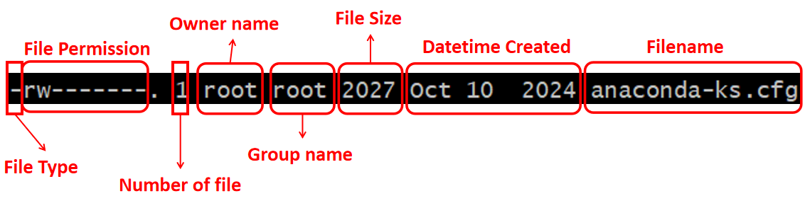
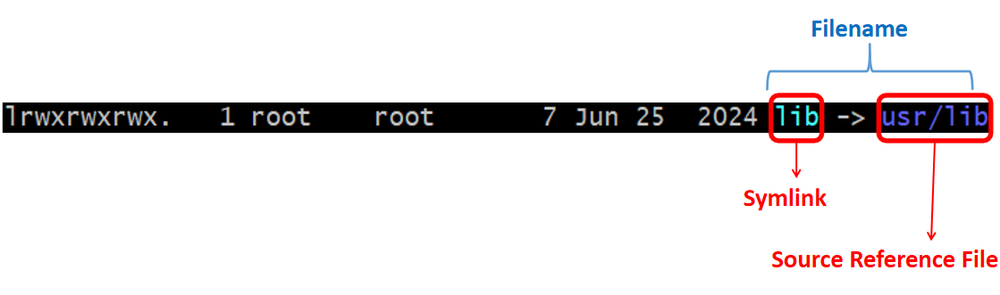
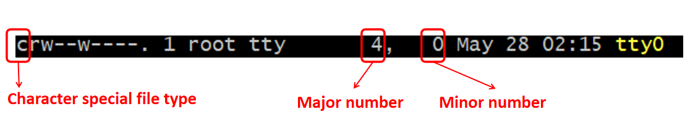
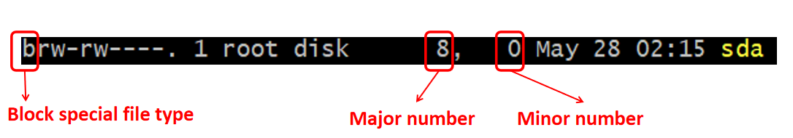
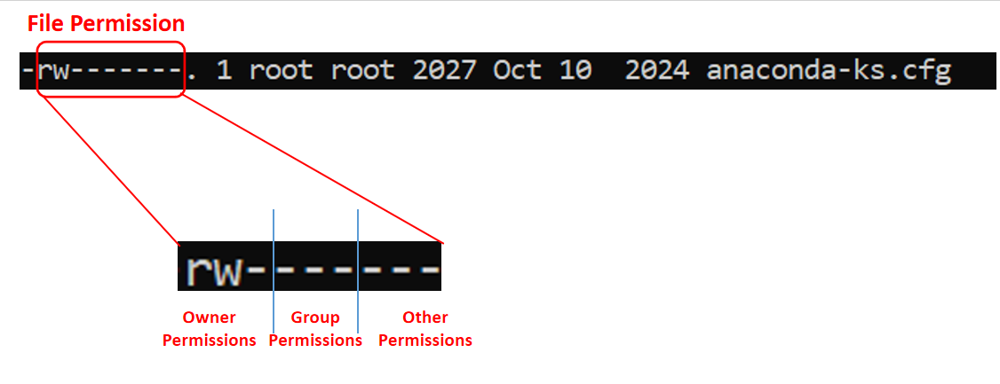

# Manipulating Files Attributes

Before proceed to the sub-topics, below is the sample picture of `ls -l` output.



In this chapter, `File Type` and `File Permission` will be the main topics to be studied.

## Identify File Type

| Character | File Type |
|:---:|:---:|
|`-`| Regular file |
| `l` | Symbolic link |
| `c` | Character special |
| `b` | Block special |
| `p` | Named pipe |
| `s` | Socket |
| `d` | Directory file |

### Regular Files

- Most common type of files you will encounter
- Store any kind of data, where it could be plain text, application-specific format or a special binary format that system can execute
- To help you what understand what data type is stored in regular file, just execute this sample command `file <FILENAME>`

### Symbolic Links

Symbolic link is a special file that points to another file on the system. 

It is `similar to shortcut or alias` if familiar with Windows or Mac OS.

Symbolic links `can point to any type of file or directory`.

If you run `ls -l` command, you will see the sample filename format as below if it is a symbolic link or commonly called `symlink`.



<br>

Use the command `ln -s <SOURCE> <SYMLINK>` to create symbolic link

### Device Files

Device files are access points to the device within the file systems.

Usualy, device files are located under `/dev` directory.

2 main types of device files are:
- Character special files
- Block special files

### Character Special Files

Character special files provide a mechanism for `communicating with a device one character at a time`. 

Usually, character devices represent a "raw" device.



Above is the sample picture of ls -l output for a character special file.

### Block Special Files

Block special files also provide a mechanism for communicating with device drivers via the file system, but `transfer large blocks of data at a time`.

This type of file typically represents hard drives and removable media.



Above is the sample picture of ls -l output for a block special file.

### Major Number VS Minor Number

For device drivers, you will see major number and minor number when running `ls -l` command in device file.

| Category | Explanation |
|:---:|---|
| Major Number | Major number is a `unique identifier` assigned to a device driver in the Linux kernel. <br><br> Each device driver has a unique major number, which is used by the kernel to identify the device and determine which driver to use when a device is accessed. <br><br> The major number is also known as `device number` or `device major`. <br><br> Major number of the device can be checked in `proc/devices`. |
| Minor Number | Minor number is a `smaller identifier` that is used in conjunction with the major number to uniquely idetify a specific device within a class of devices. <br><br> Minor numbers are used to identify specific devices within a major device class, such as `different partitions` on a hard disk drive or different USB drives. |

### Named Pipes

Named pipes, also known as FIFOs (First In, First Out), are a type of interprocess communication (IPC) mechanism provided by Linux.

With named pipes, two or more porcess can communicate with each other via a file that acts like a pipe.

### Socket Files

Socket files are another form of interprocess communication, but sockets can pass data and information between two processes that are not running on the same machine.

Socket files are created when communication to a process on another machine located on a network is required.

Internet tools in use today, such as Web browsers, use sockets to make a connection to the Web server.

## File Permissions

When executing `ls -l` command, you will see sample file permission of the file as picture below.



From the picture above, you can see there are `3 permission access levels` in the section "File Permission".
- `Owner permissions`: decides whether the file or folder can be read, write or executed by the owner of the file or folder
- `Group permissions`: decides whether the file or folder can be read, write or executed by the group that belongs to the file or folder
- `Other (world) permissions`: decides whether the file or folder can be read, write or executed by the all other users

From each of the permission access level listed above, you can see there are 3 different permissions blocks per attribute.

| Permission block position <br> (per access level) | Permission | Definition | Symbol |
|:---:|:---:|---|---|
| 1st | Read | Define whether user can view the file or folder | `r` = readable <br><br> `-` = not readable |
| 2nd | Write | Define whether user can edit the file or folder | `w` = writable <br><br> `-` = not writable |
| 3rd | Execute | Define whether user can edit the file or folder | `x` = executable <br><br> `-` = not executable <br><br> Besides the above, there are some other symbol on special permissions which will be explained in section [SUID and SGID File Permissions](#suid-and-sgid-file-permissions) |

### SUID and SGID File Permissions

Special permissions make up a fourth access level in addition to `owner`, `group`, and `other`. Special permissions allow for additional privileges over the standard permission sets.

| Bit Name | Purpose | Implementation |
|:---:|---|---|
| `SUID` (Set User ID) bit | `SUID` = the special permission for the user access level has a single function <br><br> To update in execute bit of `owner` permission attribute | `s` = A file with SUID always executes as the user who owns the file, regardless of the user passing the command <br><br> `S` = If the file owner doesn't have execute permissions |
| `SGID` (Set Group ID) bit | `SGID` = the special permission for the group access level has a single function <br><br> To update in execute bit of `group` permission attribute | `s` = If set on a file, it allows the file to be executed as the group that owns the file (similar to SUID). <br> However, if set on a directory, any files created in the directory will have their group ownership set to that of the directory owner <br><br> `S` = If the owning group does not have execute permissions |
| `Sticky` bit | This permission does not affect individual files. <br><br> However, at the directory level, it restricts file deletion. Only the owner (and root) of a file can remove the file within that directory. | `t` = Sticky bit enabled, and other are allowed to execute <br><br> `T` = Sticky bit enabled, and other are not allowed to execute |

### Changing File and Directory Permissions

Generic command line:

```
chmod <expression> <file_name/directory_name>
```

The `<expression>` can be the 2 following types:

- Symbolic
- Octal

<br>

**Symbolic Method:**

The `symbolic expression` has the syntax as below:

```
(who)(action)(permissions)
```

`(who)`:

| Letter | Represents |
|:---:|:---:|
| `u` | Owner |
| `g` | Group |
| `o` | Other |
| `a` | All |

<br>

`(action)`:

| Letter | Represents |
|:---:|:---:|
| `+` | Adding permissions to the file |
| `-` | Removing permissions to the file |
| `=` | Explicitly set the file permission |

<br>

`(permission)`:

| Letter | Represents |
|:---:|:---:|
| `r` | Read |
| `w` | Write |
| `x` | Execute |
| `s` | SUID or SGID |
| `t` | Sticky bit |

<br>

**Octal Method:**

The `octal expression` has the syntax as below:

```
X###
```

`X`: Indicates bit to set permission bit

| Permission bit value | Represents |
|:---:|:---:|
| `0` | No special permission enabled |
| `4` | SUID |
| `2` | SGID |
| `1` | Sticky bit |

`#`: Tells read, write, execute permissions of each access level, where rightmost `#` is `Other permissions`, followed by `Group permissions`, and then `Owner permissions`.

| `#` value | Binary value | Permissions |
|:---:|:---:|---|
| `0` | 000 | `---` = No read, write and execute permissions |
| `1` | 001 | `--x` = Execute permission only |
| `2` | 010 | `-w-` = Write permission only |
| `3` | 011 | `-wx` = Write and execute permissions only |
| `4` | 100 | `r--` = Read permission only |
| `5` | 101 | `r-x` = Read and execute permissions only |
| `6` | 110 | `rw-` = Read and write permissions only |
| `7` | 111 | `rwx` = With all read, write and execute permissions |