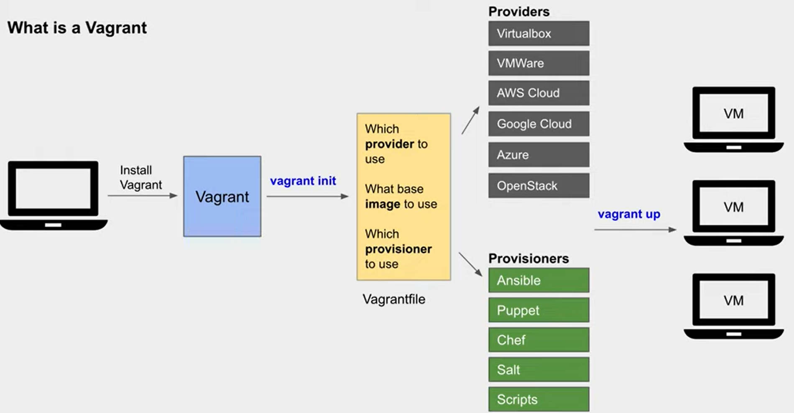

# Introduction of Vagrant

Vagrant is a **tool for building and managing virtual machine environments** in a single workflow.

For more information on virtualization, may refer to this <a href="../DevOps/03_Virtualization.md">study note</a>.

Documentation on Vagrant is available <a href="https://developer.hashicorp.com/vagrant/intro">online</a> as well.

## How Vagrant Works?

