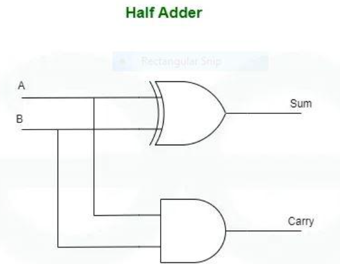

# Verilog Introduction

For a long time, computer programming languages like FORTAN, Pascal and C were used to describe computer programs and their code exuection is sequential.

However, there isn't any language to describe the digital circuits.

This is when `Hardware Description Language (HDL)` came into play. HDLs are even popular for verification purposes.

There are mainly two types of HDL:

- `Verilog HDL`
- `VHDL` (**V**ery High-Speed Integrated Circuit (VHSIC) **H**ardware **D**escription **L**anguage)

**NOTE:** 

- Verilog HDL and VHDL aren't the same 
- VHDL was used before Verilog came into existance
- This chapter will only talk about `Verilog`

## Verilog

Verilog is a **hardware description language** that is **used to realize the digital circuits through code**.

Verilog HDL is commonly used for design (<a href="https://www.geeksforgeeks.org/computer-organization-architecture/register-transfer-language-rtl/">`RTL`/`Register Transfer Level`</a>) and verification (Testbench Developement) purposes for both <a href="https://www.geeksforgeeks.org/software-engineering/fpga-vs-asic/">`Field programable gate arrays (FPGA)`</a> and <a href="https://www.geeksforgeeks.org/electronics-engineering/asic-full-form/">`Application-specific Integrated Circuits (ASIC)`</a>.

## Sections of Verilog Code

All behaviour code should be described within the keywords `module` and `endmodule`. 

Rest of the design code would mostly follow the given template.

**Verilog Sections Template:**

1) Module definition and port list declaraction
2) List of input and output ports
3) Declaration of other signals using allowed Verilog data types
4) Design may depend on other Verilog modules and hence their instances are created by module instantiations
5) The actual Verilog design for this module that describes its behaviour

```verilog
module [design_name] ( [port_list] );

    [list_of_input_ports]
    [list_of_output_ports]

    [declaration_of_other_signal]
    
    [other_module_instantiations_if_required]

    [behavoural_code_for_this_module]
endmodule
```

## Levels of Abstraction for Writing in Verilog

There are mainly three levels of abstraction:

- `Gate-Level Modeling`
- `Data-Flow Modeling`
- `Behavioural Modeling`

Let's implement all given abstraction to describe the half-adder in the diagram below.



### Gate-Level Modeling

This level of abstraction **involves describing the circuit using primitive logic gates** such as AND, OR, XOR, etc.

This level provides a detailed representation of the circuit's structure and logic.

```verilog
// Gate-Level Modeling to describe Half-Adder

module half_adder(input a,b, output sum,carry);
    xor x1(sum, a, b);
    and a1(carry, a, b);
endmodule
```

### Data-Flow Modeling

In this level of abstraction, we make use of the functions that define the working of the circuit instead of its gate structure.

This abstraction level mainly **focuses on the flow of data through the circuit logic gates or functional expressions**.

```verilog
// Data-Flow Modeling to describe Half-Adder

module half_adder(input a,b, output sum,carry);
    assign sum = a ^ b;
    assign carry = a & b;
endmodule
```

### Behavioural Modeling

This is the highest level of abstraction in Verilog.

At this level, the designers **describe the functionality of the circuit without specifying the functionality and structure  of digital circuit**.

This modeling will be helpful because it **focuses on what the circuit should do** rather than how it should be implemented.

```verilog
// Behavioural Modeling to describe Half-Adder

module half_adder(input a,b, output reg sum,carry);
    always @ (*) begin
        sum = a ^ b;
        carry = a & b;
endmodule
```

## Appendix

Reference links:

- <a href="https://www.geeksforgeeks.org/electronics-engineering/getting-started-with-verilog/">Getting Started with Verilog</a>
- <a href="https://www.youtube.com/watch?v=2IReMT_zjK8&t=31s">The best way to start learning Verilog</a>
- <a href="https://www.chipverify.com/tutorials/verilog">Verilog Tutorial</a>